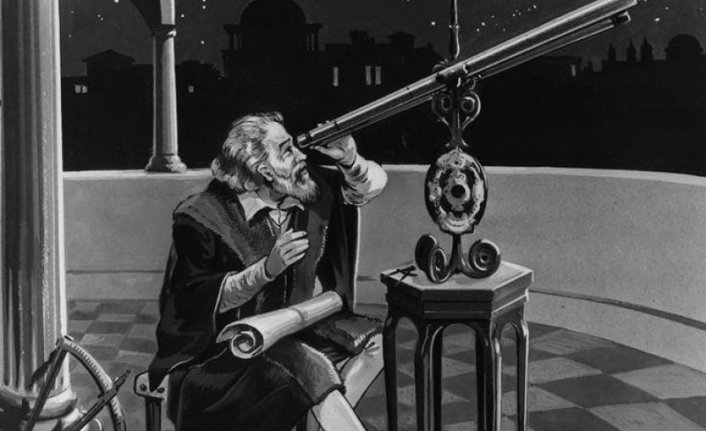
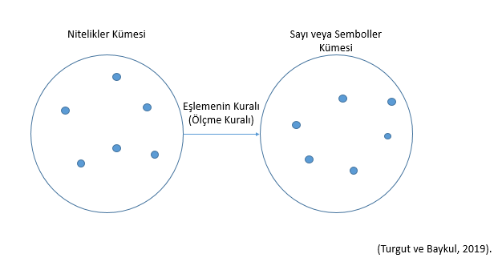

```{r echo=FALSE, message=FALSE, warning=FALSE}
library(DiagrammeR)
library(DiagrammeRsvg) 
library(rsvg) 


olcektur <- grViz("digraph{
                     graph[rankdir = TB]
                     node[shape = rectangle, style = empty]  
                     A[label = 'Ölçek Türleri']
                     B[label = 'Sınıflandırma']
                     C[label = 'Sıralama']
                     D[label = 'Eşit Aralıklı']
                     E[label = 'Eşit Oanlı']
                     A -> B [color = black]
                     A -> C [color = black]
                     A -> D [color = black]
                     A -> E [color = black]

                     }")


degiskentur <- grViz("digraph{
                     graph[rankdir = TB]
                     node[shape = rectangle, style = empty] 
                     A[label = 'Değişken Türleri']
                     B[label = 'Yapı/Özellik']
                     C[label = 'Deger']
                     D[label = 'Neden-Sonuc']
                     E[label = 'Nicel']
                     F[label = 'Nitel']
                     G[label = 'Sürekli']
                     H[label = 'Süreksiz']
                     I[label = 'Bağımlı']
                     J[label = 'Bağımsız']
                     K[label = 'Değiştirelebilen']
                     L[label = 'Seçilmiş']
                     M[label = 'Düzenleyici']
                     N[label = 'Dışsal']
                     
                     edge[color = red]
                     A -> B [color = black]
                     A -> C [color = black]
                     A -> D [color = black]
                     
                     edge[color = red]
                     B -> E[color = black]
                     B -> F[color = black]
                     C -> G[color = black]
                     C -> H[color = black]      
                     D -> I[color = black]
                     D -> J[color = black] 
                     
    J ->K[color = black];
    J ->L[color = black];
    J ->M[color = black];
    J ->N[color = black];

}")


hataturleri <- grViz("digraph{
                     graph[rankdir = TB]
                     node[shape = rectangle, style = empty] 
                     A[label = 'Hata Türleri']
                     B[label = 'Sabit']
                     C[label = 'Sistematik']
                     D[label = 'Tesadüfi']
                     edge[color = red]
                     A -> B [color = black]
                     A -> C [color = black]
                     A -> D [color = black]
                     }")


degerturleri <- grViz("digraph{
                     graph[rankdir = TB]
                     node[shape = rectangle, style = empty] 
                     A[label = 'Degisken Türleri']
                     B[label = 'Ölçüte Göre']
                     C[label = 'Amaca Göre']
                     D[label = 'Bağıl']
                     E[label = 'Mutlak']
                     F[label = 'Tanıma Yerleştirmeye\n Dönük']
                     G[label = 'Biçimlendirme ve Yetiştirmeye\n Dönük\n(Formatif) ']
                     H[label = 'Değer Biçmeye\n Dönük\n(Summatif)']

                     edge[color = red]
                     A -> B [color = black]
                     A -> C [color = black]
                     B -> D[color = black]
                     B -> E[color = black]
                     C -> F[color = black]
                     C -> G[color = black]
                     C -> H[color = black]


                                          }")

```

# Ölçmede Temel Kavramlar.huge[`r emo::ji("stats")`]


- Eğitim Nedir? 

--
- Ölçme Nedir?  

--
- Niçin Ölçme Yapıyoruz?  

--
- Değişken ve Türleri      

--
- Ölçme Türleri  

--
- Ölçmede Birim    

--
- Ölçmede Sıfır  

--
- Ölçek Türleri  

--
- Ölçmede Hata  

--
- Ölçüt ve Türleri  

--
- Değerlendirme ve Türleri  

---
# Eğitim Nedir? 

-   Eğitim; bireyin davranışında kendi yaşantısı yoluyla ve kasıtlı olarak istendik değişme meydana getirme sürecidir (Ertürk,1975:12).

```{r echo=FALSE, fig.align='center',out.width="60%"}
knitr::include_graphics("img/Resim1.png", error=FALSE)
```

--
# Ölçme Nedir?

-   Hayatın her alanında olduğu gibi **eğitim** alanında da, işin neresinde olduğumuzu, ulaştığımız sonuçları, başarılı olup olamadığımızı görmek ve bundan bir karar çıkarmak zorundayız.

--

-   Eğitim öğretim açısından da **öğrenciye kazandırmayı kararlaştırdığımız bilgi, beceri, tutum, tavır, davranış vb. gibi özellikleri, öğrencinin kazanıp kazanamadığını** görmek ve çalışmalarımızı ona göre planlamak durumundayız.

---

## Ölçme Nedir?

-   Eğitim bir sistem olarak düşünüldüğünde, bu sistemin başarılı ve başarısız olduğu yanların belirlenmesi ve **başarısızlık kaynaklarının belirlenmesi** önemlidir.

--

-   Öğrenci davranışlarındaki değişiklik uygulanan öğretimin başarısına, öğrenciden beklenen davranış değişikliğinin gerçekleşmemesi de uygulanan eğitimin başarısızlığına kanıttır.

---

.pull-left[

## Ölçme Nedir?

```{r echo=FALSE, fig.align='center',out.width="60%"}
knitr::include_graphics("img/Resim2.PNG")
```
]

--

.pull-right[

<br>
<br>
<br>
-   En son ne zaman ölçme yaptınız?


-   Sabah tartıldınız mı?


-   Bugünkü hava sıcaklığını öğrenmek için termometreye baktınız mı?

]

---

## Ölçme Nedir?

-   Eğitimde öğrenci davranışlarını **ölçmeden** bir yargıya varmak mümkün **değildir.**

--

-   Ölçme yapmak için de bir **ölçme aracı geliştirmemiz** ya da geliştirilen bir ölçme aracını kullanmamız gerekir.

--

-   Bu bakımdan yapılan **ölçme sonucunda elde edilen verilere** bakarak ve ölçme sonuçlarını önceden kararlaştırdığımız bir **takım ölçütlerle** karşılaştırarak **değerlendirmeler** yapabilir duruma gelebiliriz.

--

-   Eğitim bir **bilimdir** ve eğitim sonucu kazandırılan **özelliklerin ölçülebilmesi** gerekir.

---

## Ölçme Nedir?

-   Ölçme; insanın varlığı ile var olan ve var olmaya devam edecek olan bir kavramdır. Çünkü insanoğlunun her nasıl var olduğu kabul edilirse edilsin, var olduğu ilk andan itibaren çevresinde olan varlıkları **gözlemlemek, algılamak** ve buna göre tepkide bulunmak gibi bir mecburiyeti olmuştur.

-   Bu **gözlemleme ve algılama işi** de başlı başına bir ölçmedir. Bu sebeple ölçme kavramı insanın varlığı ile başlamakta ve hâlâ bu kavram insanla birlikte devam etmektedir.

-   Günümüzde ise ölçülemeyen şeyin bilimi yoktur yargısından sonra insanı ölçmeden ayrı düşünmek mümkün görünmemektedir.

---

## Ölçme Nedir?

-   Her bilim dalının kendine özgü özel terimleri ve bu terimlerin o bilim dalına özgü anlamları vardır.

-   İlgili bilim dalı kendine ait terimleri, kavramları, özel bilgileri ile diğer bilim dalından ayrılır. Bir kelimenin günlük dildeki anlamı ile yan anlamı, bir bilim dalındaki anlamı ve diğer bilim dalındaki anlamı farklılık gösterebilmektedir.

-   Bilim dalının oluşmasında o bilim dalına özgü terimlerin ve kuramların önemli bir payı vardır.

---

## Ölçme Nedir?

-   Ölçmenin farklı bilim dallarında **farklı tanımlarını** görmek mümkündür.

--

-   Fakat, aynı zamanda aynı bilim dalı içinde de farklı ölçme tanımları görülebilmektedir.

--

-   Ölçmenin mantığı **bir ölçme aracı oluşturmak için gerekli olan şartlarla** ilgilidir.

--

-   Ölçme, burada kullanıldığı şekli ile, karşılaştırma standardının geliştirildiği sürece atfedilir.

---

## Ölçme Nedir?

-   Geniş anlamı ile ölçme, herhangi bir niteliğin gözlenmesi ve gözlem sonucunun sayılarla ya da başka sembollerle ifade edilmesidir.

```{r echo=FALSE, fig.align='center',out.width="50%"}
knitr::include_graphics("img/Resim3.png")
```

Ölçmenin konusu, objelerin kendileri değil onların **dikkate alınan özellikleridir.**

---

# Eğitimde Ölçme

- Ölçme ve değerlendirme, **öğretimi tamamlayan bir süreçtir.**

--

- Bir öğretim programı etkili bir öğretim hizmeti ile uygulanırken bir yandan da uygulamanın her adımında gerçekleşen ürünlerin incelenmesi, **öğretme-öğrenme sürecinin istenen ürünleri verip vermediğinin izlenmesi gerekir (Özer Özkan, 2019).**

---

## Dünden Bugüne

-   MÖ 2200 yıllarında Çin'de devlet memurlarının işe alınmasında yarışmaya dayalı karmaşık denilebilecek bir seçme sisteminin uygulanması,

-   MÖ 1115 yılında Çin İmparatoru Chang tarafından devlet hizmeti sınavları haline getirilmesi ve 1905 yılına kadar devam etmesi,

-   Müzik, at yetiştiriciliği ve biniciliği, aritmetik, askerlik, okçuluk, ziraat, yazma, coğrafya, din, hükümetle ilgili hesaplama işlemleri konuları içerirdi,

---

## Dünden Bugüne

-   Bugünkü ölçme ve değerlendirme sistemlerinin kökleri

-   Puanlama güvenirliğine önem verilmesi ve gerekli önlemlerin alınması.

-   1800'lü yılların sonuna kadar pek çok yönden Avrupa ve Amerika'ya model olmuştur.

---

## Dünden Bugüne

```{r echo=FALSE, fig.align='center',out.width="60%"}
knitr::include_graphics("img/Resim4.PNG")
```


---

## Eğitimde Ölçme Hangi Amaçlarla Yapılır?

- eğitim sisteminde de ölçme, sistemin **sürdürülebilirliği**
bakımından olmazsa olmazdır.

  - tanıma ve yerleştirme  
  
--

  - izleme  

--

  - düzey belirleme  

---

##   Ölçme ve Ölçme Türleri Nedir?

- **Ölçme**, birey ya da nesnelerin niteliklerinin **uygun araçlar** kullanılarak gözlenip gözlem sonuçlarının sembollerle ifade edilmesidir (Büyüköztürk vd., 2020). 

-   **Ölçme;** insanın varlığı ile var olan ve var olmaya devam edecek olan bir kavramdır.

-   Çünkü insanoğlunun her nasıl var olduğu kabul edilirse edilsin, var olduğu ilk andan itibaren çevresinde olan varlıkları gözlemlemek, algılamak ve buna göre tepkide bulunmak gibi bir mecburiyeti olmuştur.

-   Bu **gözlemleme** ve **algılama** işi de başlı başına bir ölçmedir. Bu sebeple ölçme kavramı insanın varlığı ile başlamakta ve hâlâ bu kavram insanla birlikte devam etmektedir.

---

## Ölçme Nedir?

Ölçmek bilmektir,  
  ölçülebileni ölçün,  
    ölçülemeyeni ölçülebilir hale getirin.

**Galileo Galilei**

```{r echo=FALSE, fig.align='center',out.width="30%"}

```

---

## Ölçme Nedir?

.center[
Ölçemediğiniz hiçbir şeyi kontrol edemez, kontrol edemediğiniz hiçbir şeyi yönetemezsiniz.		

P. Drucker

]


---

## Ölçme Nedir?

-   Ölçmek - measure
--

-   **me** kökünden helen birçok kelime bulunmakta
--

-   **moon** (ay) - eskiden zamanı ölçmek için ayın pozisyonu kullanılırmış.
--

-   **month** (ay) - moon kelimesinden gelir.
--

-   **Monday** (pazartesi) - ay günü
--

-   **Semester** - six ve month
--

-   **menopause** (menapoz) - month (ay) ve pause (durmak)
--

-   **meter**, **geometry**, **thermometer**, **dimension**
--

-   **immense** (sonu olmayan büyük)

---

## Ölçme Nedir?

-   Ölçmenin farklı bilim dallarında **farklı tanımlarını** görmek mümkündür.

--

-   Fakat, aynı zamanda aynı bilim dalı içinde de **farklı ölçme tanımları** görülebilmektedir.

-   Ölçmenin mantığı bir **ölçme aracı oluşturmak** için gerekli olan şartlarla ilgilidir.

--

-   Ölçme, burada kullanıldığı şekli ile, **karşılaştırma standardının** geliştirildiği sürece atfedilir.

---

## Ölçme Nedir?

-   Geniş anlamı ile **ölçme**, herhangi bir niteliğin **gözlenmesi** ve gözlem sonucunun **sayılarla** ya da başka **sembollerle** ifade edilmesidir.

--

-   Eğitim ve psikoloji açısından ele alındığında ölçme bireyler hakkında **bilgi toplama** sürecidir.

---

## Ölçme Nedir?

-   Ölçme **tanım kümesi** ile **değer kümesi** arasında bir fonksiyon olarak tanımlanabilir.

```{r echo=FALSE, fig.align='center',out.width="40%"}

```

-   Ölçmenin konusu, objelerin kendileri değil onların **dikkate alınan özellikleridir.**

---

## Niçin Ölçme Yapıyoruz?

-   Ölçme **değişimleri** farklılıkları ortaya koymak, belirlemek amacıyla yapılır.

-   Her nesne birçok farklı özelliğe sahiptir.

-   Bu bakımdan denilebilir ki ölçme bu **farklar** üzerine temellenmiştir. 

-   Eğer özellikler arasında fark olmasaydı o zaman ölçmeye gerek duyulmazdı.


---

## Niçin Ölçme Yapıyoruz?

- Örneğin;

- Bu sınıfta, matematik derslerime önce dört işlem becerilerinden başlamam gerekiyor.

--

- En son işlediğim konuya yönelik olarak telafi dersleri yapmalıyım.

--

- Diğer konuya geçebilirim.

--

- Bu öğrencimin ailesi ile ders çalışma alışkanlığı hakkında görüşmeliyim.

--

- Bazı öğrencileri rehberlik servisine yönlendirmem gerekiyor.

--

- Bu sınıfta öğretim yöntemimi değiştirmeliyim.
gibi kararlar nasıl veriliyor?

???

Karar vermek zor iş!...

PEKİ…

Ölçme ve Değerlendirme yöntem ve teknikleri, karar almada ve bu kararı uygulamada yardımcı olabilir mi?


---

## Niçin Ölçme Yapıyoruz?

- öğrencilerin kazanacağı davranışları açıkça gösteren yeterliğe dayalı  amaçlara ne ölçüde ulaşıldığını, 

--

- öğretme-öğrenme sürecinde karşılaşılan güçlükleri belirleyebiliriz. 

--

- Toplanan bilgilerle, yeterliğe dayalı amaçlarda, öğretim stratejilerinde, kullanılan öğretim materyallerinde vb. unsurlarda düzenlemeler yapabiliriz. 


---
## Niçin Ölçme Yapıyoruz?


- öğrenciye davranışını nasıl değiştireceği, nasıl geliştireceği hakkında bilgi verir,

- yeterince başarılı olan öğrenciyi motive eder,

- öğrenci hakkında verilecek kararlara dayanak oluşturur,
 
- öğretmene kendi öğretiminin etkililiğini belirleme fırsatı verir, 

- ilgililere eğitimin nitelik ve niceliği hakkında bilgi sağlayabiliriz. 


---
## Ölçülebilen Özellikler Neler

- Başarı
- Zeka
- Öğrenme düzeyi
- Öğrenme eksikleri
- Hazırbulunuşluk
- Ön öğrenmeler
- İlgi ve yetenekler
- Algı ve tutumlar
- Kişilik
- Beklentiler
- Psikomotor beceriler ve yeterlikler.

---

# Özellik ve Değişken

- Ölçme işleminde bir insan veya bir nesnenin kendisi ölçülmez. Onların bir özelliği ölçülür. 

  - Boy, kilo, tansiyon, esnkelik, tutum v.b
  
--

- Kişiden kişiye, durumdan duruma, nesneden nesneye değişmeyen **özelliklere sabit**  denir.  Sadece tek bir değer alabilen özelliklere  sabit adı verilir.

--
 
- **Sabit** özellikler fen bilimlerinde sosyal bilimlerinden daha fazla yer almaktadır.  Örneğin; Einstein’ın enerji denklemindeki $E=mc^2$  ışık hızını gösteren $c$ değeri sabittir. 
Matematikte  $\pi$ sayısı bir sabittir. 

---

## Özellik ve Değişken

- Kişiden kişiye, durumdan duruma, nesneden nesneye değişen özelliklere **değişken** denir. 

--

-  Bir başka deyişle, iki ya da daha fazla değer alan özelliklere **değişken** adı verilir. 

--

- Örneğin; 
  - bir çoktan seçmeli test maddesi verilen cevaplar
  - bir grup öğrencinin bir testten aldıkları puanlar
  - insanların boy uzunlukları
  - zeka düzeyleri
  - cinsiyet
  
---


.center[


```{r echo=FALSE,out.width='100%'}

degiskentur

```

]

---

## Değişken Türleri

- Değişkenler, özelliklerine göre **nicel** ve **nitel** olarak sınıflandırılabilirler. 

  - **Nicel değişken**: Değişkenin özelliği, düzeyleri **sayı** ve **miktar** olarak açıklanabilir. `r emo::ji('right')` Boy, kilo, test puanı

  - **Nitel değişken:** Değişkenin özelliği, düzeyleri **sınıflandırılarak** açıklanabilir. 
`r emo::ji('right')` cinsiyet, medeni durum, eğitim alanı

  - Bu özellikler sayılarla ifade edilse bile bu sayısal gösterimler matematiksel anlamda bir büyüklük, **nicelik ifade etmezler (kız:1, erkek:2)**


---

## Değişken Türleri

- Değişkenler, aldıkları değerlere göre **sürekli** veya **süreksiz** olarak sınıflandırılır.


  - **Sürekli değişken:**  İki ölçüm arasında **sonsuz sayıda** değer alabilir. `r emo::ji('right')` test puanı, tutum, algı, koşma hızı

  - **Süreksiz değişken:** İki ölçüm arasında sadece **sınırlı sayıda** değer alabilir `r emo::ji('right')` eğitim düzeyi, sınıf düzeyi, göz rengi, meslek grubu

---

## Değişken Türleri


- Değişkenler **neden sonuç** ilişkisi içinde bulunuyorsa bu durumda bağımlı ve bağımsız değişken olarak sınıflandırılır. 

  - **Bağımsız değişken:**  Bir veya veya iki değişken üzerinde **etkisi incelenen,** olası neden olan değişkendir. `r emo::ji('right')` cinsiyet, eğitim durumu, SES

  - **Bağımlı değişken:**  Bağımsız değişkenin **etkisi ile değişen,** olası sonuç değişkendir. `r emo::ji('right')` Başarı puanı, tutum, ilgi


---

## Değişken Türleri

- İnsanların ayaklarının büyüklüğü **bağımsız**; ayakkabılarının büyüklüğü buna **bağımlı** bir değişkendir.

- Yetenek, çalışmaya ayrılan süre, ilgi, tutum **bağımsız**; başarı bunlara **bağımlı** değişkendir.

- Ziraatla ilgili bir araştırmada, tarlaya atılan gübre miktarları **bağımsız**, alınan ürün miktarı **bağımlı** değişkendir. 

---
.center[

<br>
<br>

```{r echo=FALSE, message=FALSE, warning=FALSE}
library(magrittr)
library(gt)
tx_names <- data.frame(
Değişken_Sınıfı=c("Nicel","Nitel","Sürekli","Süreksiz","Bağımlı","Bağımsız"),
Tanımı= c("Özelliğe ilişkin sayı ve ya miktar verir.",
"Özelliğe ilişkin kategorileri vardır.",
"İki ölçüm arasında sonsuz sayıda değer alır.",
"Sadece sınırlı sayıda değer alır.",
"Araştırmanın olası sonucudur.
Bireysel grupsal farklara odaklanır.",
"Araştırmanın olası nedenini ifade eder. 
Etkisi test edilecek olan değişkendir."),
Örnek=c("Test ve ya ölçek puanı,
Çocuk sayısı,
Kaldırılan ağırlık miktarı",
"Medeni durum ,
Sınıf düzeyi, Cinsiyet",
"Boy, ağırılık, test puanı",
"Medeni durum ,
Sınıf düzeyi, Cinsiyet",
"Başarı puanı,
Performans ölçümü",
"Sınav kaygısı,
Süre,
İlgi"))

tx_names %>% 
  gt::gt() %>% 
   tab_options(table.width = pct(100)) %>% 
    tab_header(
    title = md("**Değişken Türleri**"))
```

]
---

.center[
<br>
<br>
```{r echo=FALSE, message=FALSE, warning=FALSE}

tx_names1 <- data.frame(
Bağımsız_Değişken=c(
"Mezuniyet Düzeyi (Nitel, süreksiz)",
"Sayısal Beceri Test Puanı (Nicel, sürekli)",
"Matematiğe Karşı Tutum (Nicel, sürekli)",
"Cinsiyet (Nitel, süreksiz)"),
Bağımlı_Değişken=c(
"Sözel Beceri Test Puanı (Nicel, sürekli)",
"Meslek Grubu (Nitel, süreksiz)",
"Matematik Başarısı (Nicel, sürekli)",
"Eğitim Alanı (Nitel, süreksiz) "))

tx_names1 %>% 
  gt::gt() %>% 
     tab_options(table.width = pct(100)) %>% 
    tab_header(
    title = md("**Değişken Türleri**"))

```
]
---

.center[

## Değişken Türleri

Bir araştırmacı okuma hızının okuduğunu anlamaya etkisini incelemek istemektedir. Bunun için ilköğretim sekizinci sınıf öğrencilerinin belirli bir okuma parçasını ne kadar sürede okuduklarını ölçmüştür. Aynı öğrencilere okuma parçasındaki bilgileri yoklayan bir test uygulamıştır. 

**Buradaki sabit, değişken ve değişken türleri nelerdir?**
]


---

.center[

## Değişken Türleri

Bir araştırmacı boy uzunluğunun ve kilonun yüzme süresine etkisini incelemek istemektedir. Bunun için bir 8 yaş yüzme grubu öğrencilerin 50 metreyi serbest stille ne kadar sürede yüzdüklerini ölçmüştür. Aynı öğrencilerin daha sonra kelebek ve kurbağalama stillerdeki yüzme hızları ölçülmüştür.

**Buradaki sabit, değişken ve değişken türleri nelerdir?**
]

---

# Ölçme Türleri

-   Özellikler arası **farkları** ortaya koymak ve bunları anlamlı hale getirerek bir **takım sembollerle** ifade etmeye ihtiyaç vardır.

-   Ancak bazı özellikler doğrudan gözlenebildiği halde bazı özellikler **doğrudan** gözlenmeye elverişli değildir. Bunların **dolaylı** olarak gözlenip ölçülmesi gerekir.

---

## Ölçme Türleri

```{r echo=FALSE, fig.align='center',out.width="75%"}

```

---

## Doğrudan Ölçme

- Ölçmek istenilen özellik doğrudan gözlenerek ya da bu özelliğin kendisiyle doğrudan ilişkili bir ölçme aracı ile ölçülebiliyorsa, bu tür ölçmelere doğrudan (temel) ölçme denir. 

- Doğrudan ölçme yapmak demek **araç kullanmamak anlamına gelmez!!!**

- Örneğin;

  - **Öğrencilerin cinsiyetlerini gözlemleyerek kız-erkek sembolleri ile eşleştirmek** doğrudan gözlemleyerek yapılan bir doğrudan ölçme işlemidir.

  - **Bir masanın uzunluğunu cetvel ile ölçmek** masanın uzunluğunu, uzunluğu ölçen bir ölçme aracıyla, araya başka hiç bir özellik karışmaksızın ölçülebildiği için yine bir doğrudan ölçme işlemidir.


---

## Dolaylı Ölçme

-   Eğitimde bilişsel-duyuşsal alan davranışlarının ölçülmesi **dolaylı ölçmedir.**

--

-   Doğrudan ölçmenin geçerliği ve güvenirliği **yüksektir.**
--

- Örneğin;

--

  - **Havanın sıcaklığını termometre ile ölçmek** dolaylı ölçmedir. Çünkü burada sıcaklık, termometrenin cam borusu içindeki cıva ya da alkolün sıcaklıkla genleşerek boru içinde yükselmesiyle oluşan yüksekliğe bağlı olarak ölçülmektedir.

--

  - **Öğrencinin matematik dersindeki başarısını ölçmek** de dolaylı ölçmedir. Matematik başarısı doğrudan gözlemlenemez, ancak var olduğu düşünülen matematik başarısı, öğrencinin bu durumunu ortaya çıkaracağı düşünülen sorulara verdiği cevaplarla gözlemlenmeye çalışılır ve böylece dolaylı olarak ölçülebilir. 

---

## Ölçmede Birim

- Ölçmede kullanılan en küçük miktara, standart miktara **birim** adı verilir.  

--

- Örnek olarak; metre, gram, puan verilebilir. 

--

- Ölçmede iki tür birim vardır: 
  - doğal birim 
  - yapay birim

---

## Ölçmede Birim

- **Eşitlik:** Birimin her yerde ve kullanıldığı ölçme aracında daima aynı miktarı, büyüklüğü göstermesi özelliğine   denir.
   -  cm   `r emo::ji("check")` &nbsp;&nbsp;&nbsp;&nbsp;&nbsp;&nbsp; karış  `r emo::ji('x')`

- **Genellik:** Birimin olabildiğince geniş kitleler tarafından kullanılıyor ve anlaşılıyor olması özelliğidir.
  -  kg   `r emo::ji("check")` &nbsp;&nbsp;&nbsp;&nbsp;&nbsp;&nbsp;   okka  `r emo::ji('x')`


- **Uygunluk (Kullanışlılık):** Birimin, ölçülen özelliğin büyüklük ya da miktarına uygun olarak seçilebilmesi özelliğidir. 
şehirlerarası mesafeler için

  -  km   `r emo::ji("check")`  &nbsp;&nbsp;&nbsp;&nbsp;&nbsp;&nbsp;   cm   `r emo::ji('x')`  

---

## Ölçmede Sıfır


- Bir ölçme aracıyla ölçme yapılırken bir **başlangıç noktası** alınır.

--

- Ölçmeye başlangıç olan bu noktaya ölçmede sıfır noktası adı verilir. 

--

- İki tür sıfır noktası vardır: 

--

  - mutlak (gerçek) sıfır noktası 
  
--

  - göreceli (izafi, itibari) sıfır noktası
  
---

.pull-left[
## Mutlak Sıfır
- Ölçmeye başlangıç olarak seçilen sıfır noktası **gerçek, mutlak** yokluğu göstermektedir. 

- Sıfır noktası ölçülen özelliğin gerçekten var olduğu noktadır ve **bu nokta öncesi o özellik gerçekten yoktur, bulunmamaktadır.** 

- Örneğin; boyumuzu ölçerken başlangıç olarak kabul ettiğimiz sıfır noktası boyumuzun başladığı noktadır, sıfır noktası öncesi boyumuz yoktur.
]

.pull-right[
## Bağıl Sıfır
- Ölçmeye başlangıç olarak alınan sıfır noktası aslında o özelliğin **gerçek yokluğundan başlamaz.** 

- Pratikte ölçmeye başlangıç olabilmesi için seçilen bir noktadır ve sıfır noktası olarak gösterilir. Kısacası **göreceli sıfır noktası mutlak yokluğu göstermez.** 

- Örneğin; sıcaklığı termometre ile ölçerken kullandığımız 0 noktası sıcaklığın o noktada ve ondan öncesinde yok olduğunu göstermez.	$0^{\circ}$ 
 **demek sıcaklık yok anlamı taşımaz.**

]

---


## Ölçek Türleri

.pull-left[

<br>
-   **Ölçek**, birinci anlamı sayı ve sembollerin anlamlarını ya da sayı ve sembollerin verilmesinde uyulması gereken **kurallar**  
<br>
<br>
<br>
-   İkinci anlamı ise **birimle** bölmelenmiş ölçme aracını belirtmektedir (Turgut ve Baykul, 2019).
<br>
]
.pull-right[

```{r echo=FALSE, out.width='100%'}
olcektur
```

]


---


## Ölçek Türleri

| **İsim** | **Karar** |
|----------|-----------|
| Ekin     | Başarılı  |
| Arda     | Başarılı  |
| Demir    | Başarılı  |
| Ela      | Başarılı  |
| .        | .         |
| .        | .         |
| .        | .         |
| Ece      | Başarısız |
| Emel     | Başarısız |


---

## Ölçek Türleri

| **İsim** | **Başarı Sırası** | **Karar**   |
|----------|-------------------|-------------|
| Ekin     | 1\.               | Başarılı    |
| Arda     | 2\.               | Başarılı    |
| Demir    | 3\.               | Başarılı    |
| Ela      | 4\.               | Başarılı    |
| .        | .                 | .           |
|          |                   |             |
| .        | .                 | .           |
|          |                   |             |
| .        | .                 | .           |
| Ece      | 23\.              | Başarısız   |
| Emel     | 24.               | Başarısız   |


---

## Ölçek Türleri


| **İsim** | **Not** | **Başarı Sırası** | **Karar**   |
|----------|---------|-------------------|-------------|
| Ekin     | 10      | 1\.               | Başarılı    |
| Arda     | 9       | 2\.               | Başarılı    |
| Demir    | 8       | 3\.               | Başarılı    |
| Ela      | 7       | 4\.               | Başarılı    |
| .        | .       | .                 | .           |
| .        | .       | .                 | .           |
| .        | .       | .                 | .           |
| Ece      | 3       | 23\.              | Başarısız   |
| Emel     | 2       | 24.               | Başarısız   |


---


## Ölçek Türleri


| **İsim** | **Doğru Sayısı** | **Not** | **Başarı Sırası** | **Karar**   |
|----------|------------------|---------|-------------------|-------------|
| Ekin     | 10               | 10      | 1.                | Başarılı    |
| Arda     | 9                | 9       | 2.                | Başarılı    |
| Demir    | 8                | 8       | 3.                | Başarılı    |
| Ela      | 7                | 7       | 4.                | Başarılı    |
| .        | .                | .       | .                 | .           |
| .        | .                | .       | .                 | .           |
| .        | .                | .       | .                 | .           |
| Ece      | 3                | 3       | 23.               | Başarısız   |
| Emel     | 2                | 2       | 24.               | Başarısız   |

---

## Ölçek Türleri

<br>
<br>
<br>
  
|               | **Zeynep** | **Aras** | **Elif** | **Deniz** |
|---------------|------------|----------|----------|-----------|
| Eşit Oranlı   | 185 cm     | 165 cm   | 100 cm   | 85 cm     |
| Eşit Aralıklı | 85         | 65       | 45       | 15        |
| Sıralama      | 1\.        | 2\.      | 3\.      | 4\.       |
| Sınıflama     | Uzun       | Uzun     | Kısa     | Kısa      |

---

## Ölçek Türleri

<br>
<br>
<br>
  
| **Ölçek**   | **Başlangıç Noktası** | **Birimi** | **Sıra** | **Fark** | **Oran** |
|-------------|-----------------------|------------|----------|----------|----------|
| Sınıflama   | Yok                   | Yok        | \-       | \-       | \-       |
| Sıralama    | Değişken              | Değişken   | Var      | \-       | \-       |
| Eşit Aralık | Keyfi                 | Keyfi      | Var      | Var      | \-       |
| Eşit Oranlı | Mutlak                | Mutlak     | Var      | Var      | Var      |

---

# Ölçmede Hata

- **Güvenirlik** ve **geçerlik** kavramlarının temel mantığı ölçme sonuçları ve bu sonuçlar kullanılarak yapılan değerlendirmelerin **ne kadar az hatalı** olduğunun belirlenmesi üzerinde kurulmuştur.

--

  -   Ölçülen özelliğin gerçek değeri ile gözlenen değeri arasındaki fark **hatadır.**

--

-   Bir test veya ölçekten elde edilen puanlar ne zaman hatalıdır?

    -   **Hemen her zaman!**

-   Gerek fiziksel bilimlerde gerekse sosyal bilimlerde ölçüm sonuçlarına mutlaka bir miktar **hata** karışır ve bu hatanın miktarı **kesin olarak bilinemez.**

-   Hatayı ortadan kaldırmak mümkün olmasa da hata kaynaklarını belirleyip **en aza** indirmek mümkün olabilir.

---

# Ölçmede Hata

-   Ölçmeye karışan çeşitli hatalar nedeniyle gözlenen bir özelliğin **gerçek değeri doğrudan elde edilemez**, ölçme sonucu gözlenen puanlar yardımıyla kestirilmeye çalışılır.

--

-   **Hatanın miktarı arttıkça** elde edilen puan bireyin **gerçek puanından** (gerçek başarı, yetenek veya bilgi düzeyi) uzaklaşır.

--

-   Elde edilen puanın yönü iki taraflı olabilir yani olması gerekenden **fazla** veya **az** olabilir.

--

-   Hataya sebep olan etkenlerin farkında olmak, ölçme işlemine karışan **hataları azaltmaya** yardımcı olur.

--

-   Ölçümlerdeki hatanın mümkün olduğunca **azaltılması**, ölçülen özelliğin miktarı hakkında doğru bilgi edinebilmek ve bunun sonucunda doğru kararlar verebilmek açısından önemlidir.


---

## Ölçmede Hata

-   Ölçmede hataların kestirilebilmesi için **ölçmelerin tekrarı gereklidir.**

-   Her öğrenci için tek bir ölçüm sonucu olsaydı her ölçmenin sonucu kendisine eşit olacak ve ortalamadan sapmalar söz konusu olmayacaktı.

-   Bu nedenle eğitimde **hata miktarının** ve **güvenirliğin** kestirilebilmesi için **tekrarlı ölçümlere ya da ölçümlerin tekrarı** sayılabilecek yöntemlere ihtiyaç vardır.

---

## Ölçmede Hata


-   **Ölçme aracından** kaynaklanan hatalar

-   **Ölçmeyi yapan** bireyden kaynaklanan hatalar

-   **Ölçülen bireyden** kaynaklanan hatalar

-   Ölçmenin yapıldığı **ortamından** kaynaklanan hatalar

---

## Ölçmede Hata

.pull-left[

-   **Sabit ve sistematik hata**larda ölçme sonuçlarına karışan hatanın miktarı, yönü ve kaynağı bellidir. Bu sebeple bu tür hataların ölçme sonuçlarına karışmasını **engellemek ya da düzeltmek nispeten daha kolaydır.**

<br>
<br>

-   Ölçme sonuçlarına bazen pozitif, bazen de negatif önde karışabilirler. Bu nedenle **tesadüfi hatalar kontrol edilemez.**


]

.pull-right[
```{r echo=FALSE, out.width='100%'}

hataturleri
```

]


---

# Değerlendirme

```{r echo=FALSE, fig.align='center',out.width="60%"}
knitr::include_graphics("img/Resim14.PNG")
```


**Ölçme sonuç**larını bir **ölçüte veya ölçütlere** karşılaştırarak ölçülen nitelik hakkında bir **değer yargısına (karara)** varma sürecidir (Turgut ve Baykul, 2019).


---

# Değerlendirme


```{r echo=FALSE, fig.align='center',out.width="60%"}
knitr::include_graphics("img/Resim15.PNG")
```


---

# Değerlendirme

.pull-left[

-   Ayşe'nin YDS Puanı: 76

<br>

-   Yüksek lisansa kabul için gerekli olan alt sınır: 70

<br>

-   76>=70 olduğundan, Ayşe yüksek lisans için gerekli dil koşulunu sağlar.

]

--

.pull-right[


-   Mert'in matematik puanı: 76

<br>

-   Başarılı olmak için gerekli olan alt sınır: Sınıf ortalaması

<br>

-   Sınıf ortalaması 85 ve 76<85, olduğundan Mert matematik dersinden başarısız olmuştur.

]

---

## Ölçüt

-   Ölçüt elde edilen **ölçme sonuçlarına göre** ölçülen özellik ya da özellikler bakımından birey ya da nesneler hakkında **karara** varmak için belirlenen **referans ya da eşik noktası/noktaları**dır.

-   Ölçütün amaçla uyumlu olması **önemlidir**.

---

## Değerlendirme

**Örnek Durum:** Öğretmen ilköğretim 3 sınıfa başlayan öğrencilere 3 basamaklı iki sayıyı doğru olarak toplama ve çıkarma becerisini kazandırmak istiyor.

--

-   Öğretim hedefi belirlenir.

--

-   Giriş davranışları / Hazır bulunuşluk düzeyi belirlenir.

--

-   Sonuca bağlı olarak uygun öğretim stratejisi seçilir.

---

## Değerlendirme

- Değerlendirmede doğru değer yargısına ulaşmak kolay **değildir**.

--

- Doğru ve kullanışlı bir değer yargısına ulaşmak ancak şu koşullara bağlıdır:

--

  -   Ölçme sonuçları **geçerli** (ölçme amacına hizmet etme) olmalıdır.
  
--

  -   Ölçme sonuçları **güvenilir** (hatalardan arınıklık) olmalıdır.
  
--

  -   Değerlendirme geçerli ve **amaca uygun bir ölçüte** dayanmalıdır.
  
  
--

  -   Değerlendirme işlemleri hatasızca yapılabilmelidir.
  
--


---
# Değerlendirme ve Türleri

-   Öğretim programının değerlendirilmesi

--
-   Öğretim etkililiğinin değerlendirilmesi

--
-   Öğrenme eksikliklerinin saptanması

--
-   Öğrencilerin yetenek ve ilgilerine göre uygun alanlara yöneltilmesi

--
-   Öğrenci başarısının değerlendirilmesi

--
-   Değerlendirme araçlarının ve ölçütün değerlendirilmesi

---

## Değerlendirme ve Türleri

```{r echo=FALSE, fig.align='center', out.width='100%'}
degerturleri
```

---


.pull-left[
**ÖLÇME**
]
--
.pull-left[
 **DEĞERLENDİRME**
]


.pull-left[
- Gözlem sonuçlarının sayı ve sembollerle belirtilmesidir.
]
--
.pull-left[
- Ölçme sonuçlarının bir ölçütle karşılaştırılarak ölçülen nitelik hakkında bir yargıya varılması sürecidir.
]


.pull-left[
- Betimleme işidir. 
]
--
.pull-left[
- Yargılama işidir.
]

.pull-left[
- Ölçülen özelliğin miktarı belirlenir.   
]
--
.pull-left[
- Ölçülen özelliğin miktarının yeterli olup olmadığı, amaca uygun olup olmadığı belirlenir.
]

.pull-left[
- Değerlendirmeden önce yapılır.   
]
--
.pull-left[
-  Ölçmeden sonra yapılır. 
]


---

.pull-left[
**ÖLÇME**
]
--
.pull-left[
 **DEĞERLENDİRME**
]

.pull-left[
- Daha çok gözleme dayanır. 
]
--
.pull-left[
-  Karşılaştırma, yorum ve yargıya dayanır.
]

.pull-left[
-  Ölçme daha objektiftir.
]
--
.pull-left[
-  Daha çok kişisel kararlara dayanır.
]
.pull-left[
-  Ölçme daha objektiftir.
]
--
.pull-left[
-  Daha çok kişisel kararlara dayanır.Bu nedenle subjektiftir.
]

.pull-left[
-  Bir ölçüt gerektirmez.
]
--
.pull-left[
-  Bir ölçme sonucu ile ölçüt gerektirir.
]


---

## Değerlendirme ve Türleri

-   Bağıl ve Mutlak ölçüt arasındaki farkları nasıl özetleyebiliriz?

--

-   Hangi durumda bağıl, hangi durum da mutlak değerlendirme kullanılmalıdır?

--

-   Kullanılan değerlendirme türü sizce sınıf iklimini nasıl etkiler?

--

---

                                                                                           
## Değerlendirme ve Türleri

Kullanılan ölçüt türünü belirtiniz?

--

-  Matematik dersinden 70 ve üzeri alan öğrenciler başarılı sayılacaktır.

--

- Matematik dersinden ortalamanın üstünde olanlar başarılı olacaktır.

--

- Sınavda soruların %50'sini cevaplayanlar dersten geçecektir.

--

- Sınıfta en uzun boylu üç öğrenci basketbol takımına seçilecektir.    


<!-- Boyu 1.80 ve üzeri olanlar basketbol takımına seçilecektir.  -->
<!-- Sınavda sınıf ortalamasının üzerinde soru cevaplayanlar geçerli not alacaktır.  -->
<!-- 400 metreyi 10 saniyede koşan kişi/lere madalya verilecektir.  -->
<!-- 400 metreyi en hızlı koşan kişiye madalya verilecektir.                         -->

(Özer Özkan, 2019)                                                         

---

## Değerlendirme ve Türleri

**Aşağıda verilen ölçütlere göre yapılacak değerlendirme türü bağıl mıdır, mutlak mıdır?**

-   Sınavdan 50 puan ve üstü alanlar başarılı olur.
--

-   Programın hedeflerinin %60'ini gerçekleştiren başarılı olur.
--

-   Ortalamadan yüksek puan alan başarılı olur.
--

-   Yabancı dil sınavından 70 ve üstü puan alanlar Yüksek lisans programına alınır.
--

-   Okulda ilk %10'luk dilime giren öğrencilere burs verilir. Sınıftaki en başarılı öğrenciye ödül verilir.
---

## Değerlendirme ve Türleri

.three-column[
 **Ölçme**

- Emre'nin boyu 178 cm.'dir.

- 85 puanın üzerinde alanlar biyoloji öğretmeni olarak atanabilir.

- 80-89 arasındaki puanlar B seviyesi olarak kabul edilir. 
]


.three-column[
 **Ölçüt**

- Boyu 180 cm´den uzun olanlar okulun basket takımına girebilir.

- Erdem KPSS'den 92 puan almıştır. 

-  Ebru YDS'den 86 puan almıştır.
]


.three-column[
 **Değerlendirme**  

- Emre okulun basket takımına giremez.

- Erdem biyoloji öğretmeni olarak atanabilir.

- Ebru dil tazminatı olarak ayda 50 TL alacaktır. 
]


---

### Amacına Göre Değerlendirme Türleri
.three-column[

**Tanıma ve Yerleştirmeye Dönük**

- Eğitim sürecinin başında yapılır,
- Amaç : Öğrenciyi tanımak, uygun programa yerleştirmek,
- Hazırbulunuşluk düzeyi belirlenir, Asıl amaç öğrenciye **not vermek değildir**.

- Seviye tespit sınavları, muafiyet sınavları vb.

]

--

.three-column[

**Biçimlendirme ve Yetiştirmeye Dönük **

- Eğitim süreci devam ederken yapılır,

- Amaç: Eksiklerin belirlenmesi, hataları belirlemek, öğrenciye geri bildirimde bulunmak.Asıl amaç öğrenciye **not vermek değildir.**


- Kısa sınavlar, ünite testleri, tarama testleri

]

--

.three-column[

**Değer Biçmeye Dönük  (Summatif Değ.)**

-   Eğitim sürecinin sonunda yapılır,

-   Amac: Öğrencinin eğitim sonunda seviyesini belirlemek,

-   Asıl amaç not vermektir, çünkü hedeflenen eğitim süreci sona ermiştir,

-   Bitirme sınavları, uzmanlık sınavları, sertifika sınavları, finaller vb.


]


---

# Geleneksel ve Tamamlayıcı Değerlendirme

| Geleneksel                                                        | Tamamlayıcı                                               |
|-------------------------------------------------------------------|-----------------------------------------------------------|
| Öğretmen değerlendirme sürecini yapar.                            | Öğrenci değerlendirme sürecine katılır.                   |
| Değerlendirmede öğrenci aktif değildir ve sorumluluk verilmez.    | Öğrenci aktiftir, sorumluluk verilir.                     |
| Değerlendirmeler öğrenme sürecinden bağımsız olarak yapılır.      | Öğrenme ve değerlendirme süreci bir bütün olarak görülür. |

 (Doğan,2019)


---

## KAYNAKLAR

-   Doğan, N. (2019). Temel Kavramlar. Doğan, N. (Edt.) Eğitimde Ölçme ve Değerlendirme içinde (2-28). Pegem Akademi

-   Ertürk, S. (1975). Eğitimde Program Geliştirme. Ankara Yelken Yayınları

-   Frankel, J. R.; Wallen, N. E. & Hyun, H. H. (2012). How to Design and Evaluate Research in Education (8th Edition). New York: McGraw Hill International.
-   Güler, N. (2011). Eğitimde Ölçme ve Değerlendirme. Pegem Akademi.

-   Özer Özkan, Y. (2019). Ölçme ve Değerlendirme İle İlgili Temel Kavramlar. Çetin, B. (Edt.) Eğitimde Ölçme ve Değerlendirme içinde (1-22). Anı Yayıncılık.

-   Turgut, M. F. ve Baykul, Y. (2019). Eğitimde Ölçme ve Değerlendirme. PegemA Yayıncılık.

<!-- --- -->

<!-- # Ödev - I -->

<!-- Ödevinizi moodle üzerinde bulabilirsiniz. -->
<!-- -   Ödev - I (+) -->

<!-- -   [Künyesi aşağıda bulunan makaleyi ders öncesinde okuyunuz.](https://drive.google.com/file/d/11rgnn9lSEmckexq7jOxzi_LiIn6VSRrU/view?usp=sharing) -->

<!-- -   Baykul, Y. (2011). Ülkemizde Ölçme ve Değerlendirmenin Dünü -- Bugünü ve Yarını. Eğitimde ve Psikolojide Ölçme ve Değerlendirme Dergisi, 2. -->


<!-- ### SINIFLAMA ÖLÇEĞİ -->

<!-- **Homojen gruplar,** -->
<!-- **Miktar göstermez,** -->
<!-- Frekans, yüzde, -->
<!-- Saç rengi, göz rengi, cinsiyet  -->
<!-- ### SIRALAMA ÖLÇEĞİ -->
<!-- Sıralar arasında **eşit bir birim yok**, -->
<!-- **A>B**, **A<B** şeklinde yorumlar yapılabilir, -->
<!-- Futbol ligi sıralaması, öğrencilerin başarı puanlarına göre sıralanması, -->
<!-- Ortanca, yüzdelik, çeyrek sapma ....  -->
<!-- ### ARALIK ÖLÇEĞİ -->
<!-- **Eşit ölçme birimi vardır,** -->
<!-- 2 ve 3 arasındaki fark ile 3 ve 4 arasındaki fark eşittir, -->
<!-- **Keyfi başlangıç noktası,** -->
<!-- Sıfır **yokluk** demek **değildir**, -->
<!-- Sıcaklık, yetenek, ilgi, tutum, -->
<!-- Ortalama, standart sapma, pearson korelasyon, t-testi ... -->
<!-- ### ORAN ÖLÇEĞİ -->
<!-- Gerçek miktarı ölçer, **ölçme birimi eşit**, -->
<!-- Gerçek sıfır, -->
<!-- Kardeş sayısı, boy, ağırlık , -->
<!-- Geormetrik ortalama,.... -->
