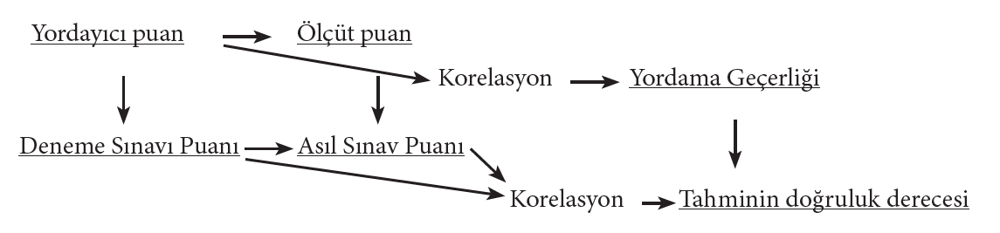
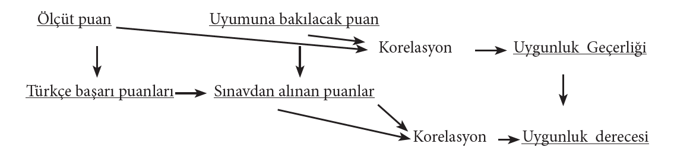

```{r echo=FALSE, message=FALSE, warning=FALSE}
library(emo)
library(DiagrammeR)
library(DiagrammeRsvg) 
library(rsvg) 
library(ggplot2)
gecerlik <- grViz("digraph{
                     graph[rankdir = TB]
                     node[shape = rectangle, style = empty] 
                     A[label = 'Geçerlik Kanıtları']
                     B[label = 'Kapsam Geçerliği']
                     C[label = 'Yapı Geçerliği']
              
                     D[label = 'Ölçüt Geçerliği']
                     E[label = 'Yordama Geçerliği']
                     F[label = 'Uygunluk Geçerliği']
                  
                    edge[color = red]
                     A -> B [color = black]
                     A -> C [color = black]
                     A -> D [color = black]
                     D -> E [color = black]
                     D -> F [color = black]
                     }")

```


```{r echo=FALSE, message=FALSE, warning=FALSE}

yapigecerlik <-DiagrammeR::grViz("digraph {

graph [layout = dot, rankdir = LR]

# define the global styles of the nodes. We can override these in box if we wish
node [shape = rectangle, style = filled, fillcolor = Linen]


process [label =  'Teoride ölçülmek\n istenilen yapı\n Hazırlanan bir yetenek \n testini ele alalım.\n
Örn: Sayısal yetenek
']
statistical [label = 'Pratikte bu yapıyı ölçmek \niçin hazırlanılan ölçme aracı\n\n
Örn: Testteki tüm soruların sayısal\n yeteneği ölçüyor olması
']


# edge definitions with the node IDs
 process -> statistical
}")
```

---
.center[
## Ölçme Araçlarında Aranan Özellikler]

.three-column[
**GÜVENİRLİK **

Bir ölçme aracının tesadüfi hatalardan arınık olma derecesidir.
Ölçme araçlarının
  - DUYARLILIĞINI
  - KARARLILIĞINI
  - TUTARLILIĞINI
<br>
belirtir.

]
.three-column[
**GEÇERLİK**

Ölçme aracının ölçmenin amacına uygun olma derecesidir.

]
.three-column[
**KULLANIŞLILIK**

Ölçme aracının kullanılmasında sağladığı kolaylıklardır

]

---
## Geçerlik

-   Bir ölçme aracının ölçülmek **istenen özelliği ölçüp ölçmediği hakkında** karar vermek için birden fazla kanıta ihtiyaç vardır.

-   Bu yönüyle **geçerlik**, ölçme aracını kullanan kişinin ölçme sonuçlarından çıkarılacak yorumları ve ölçme sonuçlarının kullanımını desteklemek için topladığı **kanıtlar** olarak tanımlanabilir.

-   Bu açıdan bakıldığında, geçerlik tek bir katsayıyla ifade edilmek yerine testin geliştirilme ve kullanılış **amacına hizmet eden kanıtların toplanmasıyla** yorumlanabilir.


---
## Geçerlik Kanıtları

--

```{r echo=FALSE, fig.align='center',out.width="100%"}
gecerlik
```


---
## Geçerlik

- Bazen bir nitelik ölçülürken **ölçme sonuçlarına başka bir nitelik karışır.** 

--
- Geçerlik, bir ölçme aracının ölçülmek istenen niteliği ölçmesi ve **amaca hizmet etme derecesi** olarak tanımlanır. 

--

- Bir ölçme aracı veya yönteminin onunla ölçülmek istenen değişkeni ölçüp ölçmediği; ölçebiliyorsa onu başka değişkenlerden ne derece arınık olarak ölçtüğüdür.

--
- **Güvenirlik** kestirme yolları, puanların birbirine benzerliği yani **tutarlılığı** üzerinde durulurken, **geçerlikte** ise ölçme aracının **ne ölçtüğü yani içerik** önem kazanır.


---
## Geçerlik

- Geçerlik, ölçme aracından elde edilen **ölçme sonuçlarındaki değişkenliğin ne kadarının bireylerin ölçülen özelliğine sahip oluş dereceleri arasındaki gerçek farktan geldiğini gösterir. **

--
- Burada önemli olan **ölçme aracının gerçekten o özelliği ne kadar doğru biçimde** ölçtüğüdür. Bunla ilgili karar vermek için de **farklı kanıtlara** ihtiyaç duyulmaktadır.


---
## Geçerlik

-   Geçerli bir ölçme aracı öğrencilere ne bildiklerini gösterme şansı veren ölçme aracıdır.

1.  Hangi konular teste/sınava dahil olmalı?

--

2.  Hangi tip maddeler kullanılmalı?

--

3.  Sınavda kac madde yer almalı?

--

4.  Hazırlanan sınavdan elde edilecek puanlar benzer amaçla hazırlanmış sınavlarla uyumlu?

--

5.  Hazırlanan sınavdan elde edilecek puan gelecekteki başarıyı kestirmede ne kadar başarılı?

---
## Kapsam Geçerliği

- Hangi konular teste/sınava dahil olmalı/olmamalı?

- 5 konu arasından sadece 2’si üzerinden sınav oluşturmak

- Ders esnasında işlenmeyen ama öğretim programında olan konuların sınavlarda yer alması

- Başarı sınavlarında dikkat ölçmek

- Sınavlarda bilerek öğreniciyi yanıltmak  (Doğru olmayan bilgi üzerinden soru sormak)

???
Önsözden soru sormak
Dipnottan soru sormak

Sadece coktan secmeli, dogru yanlis sorulardan olusan sinavlar mi? 
Sadece uzun cevapli, acik uclu sorulardan olusan sinavlar mi?
Karisik soru tipinde olusan sinavlar mi


---
## Kapsam Geçerliği

- Sınavda kaç soru yer almalı?

- Derslerde işlenen her kazanım sınavda temsil edilmeli mi?

- Her kazanımdan eşit soru mu gelmeli?

- Sınavda yer alacak soru sayısı nelere bağlıdır?
  - Sınavda yoklanacak kazanım sayısına.
  - Kazanımlarin önemine
  - Sınav süresine
  - Sınav hedef kitlesininin gelişim düzeyine

---
## Kapsam Geçerliği

- Ölçme aracının ölçmesi **istenilen kapsamı, dengeli bir şekilde, ne eksik ne de fazla olmaksızın** ölçebilmesinin derecesidir.


```{r echo=FALSE, fig.align='center',out.width="60%"}
knitr::include_graphics("img/KapsamGecerligi.PNG",error = FALSE)
```

---
## Kapsam Geçerliği

- Konu kapsamındaki davranışları yeterince **örnekleyememesi**
  - (Örn. 5 konudan oluşan bir ölçme kapsamı için bir test hazırlayan öğretmenin bu 5 konunun 3’ünden soru hazırlayıp 2’sinden soru hazırlamaması)

--
- Sorunun konu kapsamında ölçülecek bir davranışın dışında **başka bir davranışı ölçmesi** 
  - (Örn. Kümeler konusu için hazırlanan bir matematik testinde, testi hazırlayan öğretmenin rasyonel sayılarla ilgili bir soruyu teste koyması)

--
- Konu kapsamında olduğu halde **ölçülmek istenmeyen bir davranışı ölçmesi**
  - (Örn. Kritik davranışlar dışındaki bir davranışın teste alınması)

--
- **Konu kapsamında yer alan ve ölçme konusu olan davranışı ölçememesi**
 - (Örn. Başarı testinde kritik davranışları ölçmeye yönelik sorular teste konulmuş olsun. Bu testteki soruların bazılarının ölçülecek kritik davranışı ölçmemesi)


---
## Kapsam Geçerliği

- Ölçülmesi hedeflenen davranışlar evreninin, ölçme aracında yer alan sorularla (davranışlar örneklemi) iyi bir şekilde temsil edilmesi için 

--
  
  - Belirtke Tablosu Hazırlama

  - Uzman Kanısına Başvurma
 
  - Aynı Kapsamı ölçen başka testlerle korelasyon

--

- yöntemleriden yararlanılabilir.  

---
## Kapsam geçerliğini belirleme yolları

- **Uzman kanısına başvurma:** Testte yer alan her sorunun bu konuda uzman olan kişilere verilerek onlardan, soruların ölçülmek istenen davranışları kapsama derecesini belirtmeleri istenir.

- Belirtke tablosu

| | Bilgi | Kavrama | Uygulama |Toplam|
|---|---|---|---|---|
| 1.Ünite|3|3|2|8|
| 2.Ünite|2|3|4|9|
| 3.Ünite|1|3|4|8|
| Toplam|6|9|10|25|

Sütunlarda hedef-davranışların satırlarda içeriğin bulunduğu tablodur.  Burada yer alan hedef-davranışlara yönelik sorular hazırlanır.

---
##Kapsam geçerliğini belirleme yolları

- **Aynı kapsamı ölçen başka testlerle korelasyon:** Eğer elimizde kapsam geçerliği belirlenmiş bir test varsa, bu teste dayanarak başka bir testin kapsam geçerliğini belirleyebiliriz.


---
##Kapsam geçerliğini belirleme yolları

- **Kapsam geçerliği**, testin geçerli görünüp görünmediği hakkında bilgi verir, ancak testin **yüksek bir okuma seviyesi gerektirip gerektirmediği** veya test **maddelerinin iyi ifade edilip edilmediği** hakkında bilgi vermez. 


--


- Bu nedenle bir **test kapsam bakımından geçerli görünebilir ancak ölçmek istenenden farklı yetenekleri ölçebilir:** tahmin yeteneği, okuma yeteneği, vb.

---
## Yapı Geçerliği

- Bireylerde var olduğu kabul edilen ancak gözle görülemeyen özellikler **yapı** olarak adlandırılır. 

  - Zeka, tutum, ,ilgi, kaygı, vb. 

--

- Yapı geçerliği, **bir ölçme aracının ölçmeyi amaçladığı yapıyı açıklama düzeyi** olarak ifade edilebilir.

--

- Bir test, öğrencilerin aritmetik problem çözme yeteneklerini ölçmek için hazırlanmışsa, testi oluşturan maddelerin  öğrencilerin sadece aritmetik problem çözme yeteneğini ölçüp ölçmediğine, her maddenin öğrencileri sadece belirtilen özellikleri açısından ayırıp ayırmadığına dair kanıtlar toplanmalıdır.

---

## Yapı Geçerliği

```{r echo=FALSE, fig.align='center',out.width="100%"}
yapigecerlik
```

---

## Yapı Geçerliği

- Yapı geçerliği ile ilişkili kanıtlar elde etmek için çeşitli yöntemler kullanılabilir. 

- ***Faktör Analizi:** Ölçme aracının ölçtüğü özelliklerin sayısı ve herbir özelliğin toplam puana katkısı hesaplanır. Böylece ölçme aracının ölçtüğü yapı veya yapılar ortaya çıkarılarak yapı geçerliğine ilişkin kanıt elde edilebilir. 

- **Madde Puanı ile Toplam Puan Arasındaki Korelasyon:** Ölçme aracını oluşturan maddelerin puanı ile toplam puan arasındaki ilişkinin derecesini belirten korelasyon katsayısı ölçme aracının homojenliğine dolayısıyla yapı geçerliğine ilişkin bir kanıt olarak kullanılabilir

---

## Yapı Geçerliği

- Yapı geçerliği ile ilişkili kanıtlar elde etmek için çeşitli yöntemler kullanılabilir. 

  - İlişkili yapılar ile korelasyon
  - Cevaplama süreci analizi:
  - Ölçülen özelliğe sahip olma düzeyine göre gruplar arasındaki farkların incelenmesi

---
## Ölçüte Dayalı Geçerlik

- Bir testin geçerli olduğunu ortaya koymak için başka testlerle ya da ölçme sonuçlarıyla korelasyonuna bakmak.
Bu tip geçerlik kestirme yolu iki başlık altında incelenir:

- Geçerliği ve güvenilirliği daha önceden belirlenmiş bir ölçüt

- **Eşzaman geçerliği:** Aynı ya da yakın zamanda ölçüt alınan ölçme aracının uygulanması

- **Yordama geçerliği:** Ölçüt alınan ölçme sonuçları ileri bir zaman diliminde elde edilir


---

## Yordama (Tahmin) Geçerliği:

- Ölçülen davranış ya da özelliğin gelecekteki durumu hakkında tahminde bulunmaya **yordama** adı verilir. 

--

- **Ölçüt** olarak seçilen ölçme aracından elde edilen puanlar, hazırlanan ölçme aracından elde edilen puanlardan **daha sonra** elde edilmişse, bu puanlar arasındaki ilişkiye dayalı geçerliliğe **yordama (tahmin) geçerliği** adı verilir. 

--

---

## Yordama (Tahmin) Geçerliği:


- Bir KPSS hazırlık kursunda, öğrencilerin bir **deneme sınavından** aldıkları puanlar (yordayıcı, tahmin edici)  ile **asıl sınavdan** aldıkları (ölçüt puanlar) arasındaki korelasyon hesaplanırsa, elde edilecek değer  **deneme sınavının yordama geçerliğinin** ölçüsünü verir. 

--


```{r echo=FALSE, fig.align='center',out.width="60%"}

```
---

## Yordama (Tahmin) Geçerliği:

- Yordama geçerliğinde, hazırlanan ölçme aracıyla elde edilen puanlar **gelecekteki bir durumu tahmin etmekte** kullanılır. 

--

- Bu sebeple **ölçüt kabul edilecek puanlar** henüz mevcut değil, **gelecekte var olacak puanlardır.** 

--

- Genellikle bir testten alınan puanlara dayanılarak, bireylerin belli bir programdaki ya da işteki başarılarını önceden kestirme işlemidir. 

--
- Örnek: Üniversite sınavında alınan puanla üniversiteye girmiş birinin orada aldığı notlar arasındaki korelasyon katsayısı, ÖSS’nin yordama katsayısıdır

---
## Uyum Geçerliği

- **Ölçüt** olarak seçilen ölçme aracından elde edilen puanlar, hazırlanan ölçme aracından elde edilen puanlardan **aynı zamanda veya daha önceden** elde edilmişse, bu puanlar arasındaki ilişkiye dayalı geçerliliğe zamandaş geçerliği adı verilir. 

--

- Hazırlanan ölçme aracının, ölçülen özelliğin var olan durumu uygun bir şekilde ölçüp ölçmediğini belirlemek için kullanılabilir. 

--

 Bu sebeple ölçüt kabul edilecek puanlar zaten mevcuttur ve bu puanların elde edildiği ölçme aracının güvenirlik ve geçerliğinin yüksek olması gerekmektedir. 

---
## Uyum Geçerliği

- Orta öğretimdeki bir sınıfın ders yılı ortalarında Türkçe öğretmeni değişmiş
olsun. Bu sınıfta derse başlayan öğretmen bir süre sonra uyguladığı Türkçe sınavının
uygunluk geçerliğini belirlemek istesin. Bu durumda Türkçe öğretmeni kendi
uyguladığı sınavdan öğrencilerinin aldıkları puanlar ile öğrencilerinin önceki sınıftaki
başarı puanları (bu puanların güvenilir ve geçerli olması gerekir) ile korelasyonuna
bakarsa, bulacağı değer öğretmenin uygulamış olduğu sınavın uygunluk geçerliğinin
ölçüsünü verecektir. 


--
 
```{r echo=FALSE, fig.align='center',out.width="60%"}

```
---


---

## Güvenirlik- Geçerlik

- Ölçme araçlarından elde edilen sonuçların geçerliği ve güvenilirliği birbirleri ile iç içe geçmiş kavramlardır.

--

- Biri üzerindeki olumsuz bir etki dolaylı olarak diğerini etkileyecektir. 

  -  Örn: test kapsamından kaynaklanan hata

--

- Not: Güvenirlik geçerlik için ön şarttır ancak yeterli değildir. Güvenirliği yüksek olan testler her zaman geçerli olmayabilir.

--

- Bir sözel yetenek testinin güvenirliği yüksek olabilir ancak bu test öğrencilerin sayısal yeteneklerini belirlemek ve onları bu özelliklerine göre sıralamak amacıyla kullanılamaz.


---

## Güvenirlik- Geçerlik

- Bir sınav geçerli ise güvenilirdir. Ancak tersi her zaman doğru değildir. Yani bir sınav güvenilir ise geçerlidir ifadesi her zaman doğru değildir. 

--

- Bir ölçme aracı güvenilir ise geçerlidir diyemeyiz. Güvenilir olup geçerli olmayabilir. 

--

- Güvenirlik, bir ölçme aracının geçerliği için gerekli koşul olup, yeterli koşul değildir.

--

- Güvenirlik ve geçerliğin varlığı bir **derece** olarak ifade edilebilir. 

--

- Güvenirlik ve geçerlik **var ya da yok** olarak ifade edilmez.

--

- Bir ölçme işleminde geçerlik “ne ölçülecek?”güvenirlik ise “nasıl ölçülecek?” sorusunun cevabını inceler.

--

- Hataların tümü testin geçerliğini düşürür. 

--

- Fakat güvenirlik, sabit ve sistematik hatalardan etkilenmeyip sadece tesadüfi hatalardan etkilenir. 

--

- Çünkü sabit ve sistematik hataların kaynağı ve miktarı belli olduğundan meydana getirdikleri etkiler giderilebilir. Fakat tesadüfi hataların kaynağı ve miktarını bilemediğimizden bu mümkün değildir.


---
## Güvenirlik- Geçerlik


```{r echo=FALSE, fig.align='center',out.width="60%"}
knitr::include_graphics("img/Guvenirlik-gecerlik.PNG",error = FALSE)
```

---
## Güvenirlik- Geçerlik


- Bir testin geçerliği onun güvenirliğini sınırlar. (Bir testin geçerlik katsayısı, o testin güvenirlik katsayısının karekök değerini geçemez. Örn; güvenirliği 0,64 ise geçerliği en çok 0,80 olabilir)

--

- Bir  öğretmenin her yıl aynı soruları sorması öncelikle geçerliği düşürür. 

--
- Geçerli olan bir araç güvenilir sonuçlar verir fakat güvenilir bir araç her zaman geçerli olmayabilir.


---

.center[
.hand-large[teşekkürler !]


`r emo::ji('thanks')` 

]