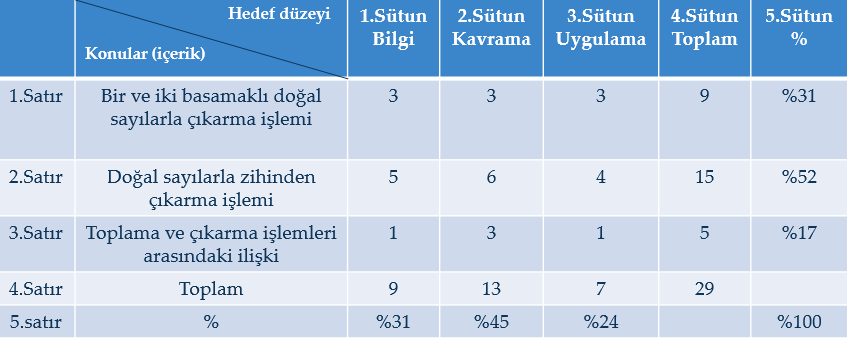
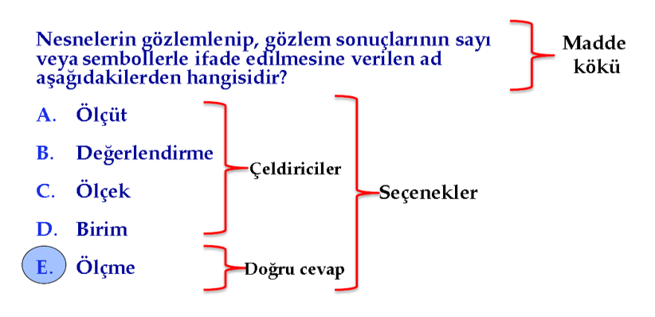
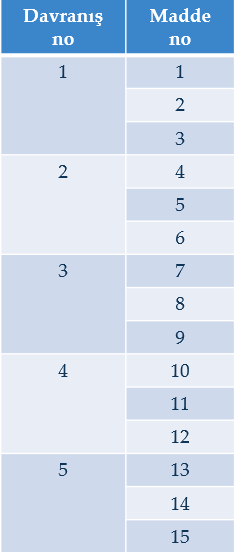

```{r set-theme, include=FALSE}
library(xaringanthemer)
style_duo_accent(
  primary_color      = "#0F4C81", # pantone classic blue
  secondary_color    = "#B6CADA", # pantone baby blue
  header_font_google = google_font("Raleway"),
  text_font_google   = google_font("Raleway", "300", "300i"),
  code_font_google   = google_font("Source Code Pro"),
  text_font_size     = "30px"
)
```

```{r, include=FALSE}
advdate <- function(obj, adv) {
 tmon <- obj + 7*(adv-1)
 # tfri <- obj + 4 + 7*(adv-1)
 tmon <- format(tmon, format="%d/%m")
 # tfri <- format(tfri, format="%d/%m")
 zadv <- sprintf("%02d", adv)
 tmp <- paste("Hafta ",zadv,sep='',", ", tmon)
 return(tmp)
}

library(lubridate)
options(scipen=999)
library(tidyverse)
library(stevemisc)
mon <- ymd(20220207)
```

## Test Geliştirme

- Bir birey ya da grup üzerinde yapılan ölçmelerde kullanılan araçlara test adı verilir.

- Test geliştirme, özellikleri önceden belli bir yaklaşıklıkla kestirilebilen bir test hazırlama işidir.

- Eğitim etkinlikleri ile kazandırılmak istenen davranışları öğrencilerin kazanıp kazanmadıkları, eğer kazandılarsa bunun derecesini belirlemek için hazırlanacak ölçme aracının hazırlanması belli aşamalardan geçer. 


---
## Test Geliştirme Adımları

- TESTİN (TEST PUANLARININ) HANGİ AMAÇLA KULLANILACAĞININ BELİRLENMESİ

- TESTLE ÖLÇÜLECEK NİTELİKLERİN SAPTANMASI

- MADDELERİN YAZILMASI

- MADDELERİN GÖZDEN GEÇİRİLMESİ (REDAKSİYON)

- DENEME FORMUNUN HAZIRLANMASI

- DENEME UYGULAMASININ YAPILMASI

- DENEME UYGULAMASI CEVAP KAĞITLARININ PUANLANMASI, MADDE ANALİZİ VE MADDE SEÇİMİ

- NİHAİ TESTİN OLUŞTURULMASI VE İSTATİSTİKLERİNİN KESTİRİLMESİ


---
## TESTİN (TEST PUANLARININ) HANGİ AMAÇLA KULLANILACAĞININ BELİRLENMESİ


- Testlerin öğretim programları ve öğretim hizmeti yönünden kullanılış amaçları
- Öğretim programının sağlamlığı
- Davranışların ulaşılabilir olması
- Davranışlar arasındaki örüntünün uygun olması
- Öğretim hizmetinin niteliği
  
--

- Testlerin öğrenciler yönünden kullanılış amaçları
- Öğrenme eksikliklerinin belirlenmesi
- Öğrencileri yetenek ve ilgileri doğrultusunda yönlendirme
- Öğrenme düzeyini belirleme (öğrenci başarısını saptama)
- Öğrenme güçlüklerinin saptama 


---
## TESTLE ÖLÇÜLECEK NİTELİKLERİN SAPTANMASI


- Testin amacı, ölçülecek özelliklerin belirlenmesinde etkilidir.

--

- Eğitimdeki ölçmeler daha çok okuldaki öğrenme ürünleriyle ilgilidir. 

--

- Öğrenme ürünü=davranış

- BLOOM 
- Bilişsel 
- Duyuşsal
- Psikomotor


---
## TESTLE ÖLÇÜLECEK NİTELİKLERİN SAPTANMASI


- **Davranışların saptanmasında başvurulabilecek bazı yollar**
  
- Konu ile ilgili kaynakların ve araştırmaların incelenmesi  
--

- Uzman kanısına başvurma  
--

- Ders kitapları, öğrenci ve öğretmen ders notları ve diğer   - öğrenme-öğretme malzemeleri  
--

- Doğrudan gözlemler  
--

- Konuların analizi  
--

- Belirtke tablosu hazırlama  
--

-  Test kapsamını belirlemenin en etkili yollarından biridir.   


---
## TESTLE ÖLÇÜLECEK NİTELİKLERİN SAPTANMASI

```{r echo=FALSE, fig.align='center'}

```

---
## MADDELERİN YAZILMASI

- Belirtke tablosu yapıldıktan sonra test geliştirmede sıra soruların yazılmasına gelir. Soruların yazılmasında;

- Soruların belirtke tablosunda yer alan davranışları yoklaması

- Alt konulara göre soru sayılarının önceden saptanan ağırlığa uygun olması

- Kullanılacak soru türünün yoklanacak davranışa uygun olması
  
  
---
## MADDELERİN YAZILMASI


- Kullanılacak soru türünün yoklanacak davranışa uygun olması gerekir. 

- Bir davranışı yoklamak için belli bir soru türünün kullanılmasında ısrar etmek yerine, davranışı ortaya çıkarmaya en uygun soru türünün seçilmesi yoluna gidilmelidir. Aksi halde soru ölçülmek istenen davranışı yeteri kadar veya hiç ölçemeyeceği için sorunun  geçerliği düşük olur. 

- Örneğin; 
- Beden eğitimi dersiyle ilgili bir alanda öğrencilerin 100 metreyi ne kadar zamanda koşacakları yoklanmak isteniyorsa öğrencileri 100 metre koşturmak

- Belli bir konuda kompozisyon yazma becerileri ölçülmek isteniyorsa konuyu verip kompozisyon yazmalarını istemek

- Bir konuyla ilgili temel kavramları kazanmış olup olmadıklarını veya bir grup problemi doğru çözüp çözmediklerini yoklamak amacıyla da bu kavramları veya problemleri içeren bir çoktan seçmeli test vermek gerekebilir. 


  
---
## MADDELERİN YAZILMASI

- Madde, testin puanlanabilen en küçük birimidir. 

```{r echo=FALSE, fig.align='center',out.width="60%"}

```


  
---
## MADDELERİN YAZILMASI


- **Madde kökünde bulunması gereken bazı özellikler:**

- Madde kökü sorunun sorulduğu, beklenen davranışın ortaya çıkması için cevaplayıcıya uyarıcının verildiği esas kısımdır.

--

- Madde kökü sadece o madde ile ilgili davranışı yoklamaya dönük olmalıdır, başka davranışları da içerir nitelikte olmamalıdır.

--

- Madde kökü olabildiği kadar açık-seçik ifade edilmiş olmalıdır.

--

- Madde kökünde gereksiz açıklama ve ifadelerden kaçınılmalıdır.

--

- Madde kökünde, seçeneklere ipucu veren ifadeler kullanılmamalıdır
  
  
---
## MADDELERİN YAZILMASI


- **Çeldiricilerde bulunması gereken bazı özellikler:**

--

- Anlam ve dilbilgisi bakımlarından madde kökü ile uyumlu olmalıdır. 
--

- Seçeneklerin uzunlukları birbirine yakın olmalıdır. 
--

- Çeldiricilerin doğru cevaba yakınlığı maddenin düşünülen güçlüğüne paralel olmalıdır. 
--

- “Yukarıdakilerin hepsi” veya “Yukarıdakilerin hiçbiri”  seçenekleri dikkatli kullanılmalıdır. (Örnek) 
--

- Seçeneklerin sıraya konulabileceği maddelerde, bunların seçeneklere yerleştirilmesi belli bir sırada olmalıdır. (Örnek)
-- 

- Bir testteki bütün maddelerin seçenek sayıları aynı olmalıdır.
--

- Seçenek sayısı testin hitap edeceği öğrenci düzeyine uygun olmalıdır.

---
## MADDELERİN YAZILMASI

- Madde yazıcılarında bulunması gereken bazı özellikler:

--

- Testin hazırlanacağı konu alanına hakim olmalıdır.

--
- Hedef, davranış, davranışların sınıflandırılması, aşamalı sınıflama ve bu sınıflamada her sınıfın özellikleri, çoktan seçmeli test maddesi yazmada dikkat edilecek konularda yetişmiş olmalıdır. 

--

- Türkçeye hakim olmalıdır. Madde yazarı madde kökünü en sade, anlaşılır, dilbilgisi yönünden hatasız olarak yazması gerekir. 

--

- Madde yazarının genel olarak yapılan yanlışları bilmesi, çeldirici bulmada kolaylık sağlar. 


---
## MADDELERİN GÖZDEN GEÇİRİLMESİ (REDAKSİYON)

- Maddeler yazıldıktan sonra;

- her bir maddenin ölçülmek istenen davranışı ölçecek nitelikte olup olmadığı (geçerliği)
--

- bilimsel yönden bir yanlışlığının bulunup bulunmadığı
--

- dil yönünden anlaşılır olup olmadığı ve dilbilgisi hatasının bulunup bulunmadığı
--

- testin ve maddelerin teknik özellikleri bakımından kusurlu olup olmadığı
--

- testin uygulanacağı öğrenci grubuna uygun olup olmadığı
 yönlerinden kontrolü gerekir. 

--

- Bu kontrollerden sonra 
- Çıkarılması gereken maddeler çıkarılır. 
- Düzenlenmesi gereken maddeler düzenlenerek son halleri teste alınır.


---
## DENEME FORMUNUN HAZIRLANMASI

.pull-left-wide[
- Maddelerin sayısal özelliklerinin saptanabilmesi için, redaksiyondan geçirilen maddelerin deneme uygulamasına tabi tutulması, bu uygulamadan yararlanılarak sayısal özelliklerin saptanması gerekir. Bu amaçla redaksiyondan geçirilen maddelerden bir deneme formu oluşturulur. 


- Deneme uygulamasına konulacak madde sayısının, esas teste konulacak madde sayısının üç katı olması tavsiye edilir. 
]

--

.pull-right-narrow[
```{r echo=FALSE, fig.align='center',out.width="40%"}

```
]

---
## DENEME FORMUNUN HAZIRLANMASI

- 5 davranışı ölçme amacıyla hazırlanmış 5x3=15 maddelik bir deneme testinde davranışlara ait üçer maddenin sıra aile art arda getirilirse bazı sorunlarla karşılaşılabilir. Bu sorunları ortadan kaldırabilmek için ; 


- Maddeler tesadüfi olarak dağıtılabilir.

--

- Maddeler sistematik tesadüfi olarak dağıtılabilir.

--

- Form yazılırken kullanılan punto sınıf seviyelerine uygun olmalıdır. 

--

- Test yönergesi hazırlanmalıdır. Deneme formunun başında test hakkında bilgi veren ve cevaplamanın nasıl yapılacağını açıklayan yapılardır.  (Örnek)

---
## DENEME UYGULAMASININ YAPILMASI


- Deneme uygulaması, maddelerin sayısal özelliklerini hesaplamak için yapılır. 

- Deneme grubu testin uygulanacağı esas gruba benzer olmalıdır.  Çünkü madde istatistikleri gruba bağlı olarak ortaya çıkar. 

---
## DENEME UYGULAMASININ YAPILMASI

- Uygulama sırasında dikkat edilmesi gerekenler:
- Cevaplayıcıların testi sadece kendilerinin cevaplamaları sağlanmalı, herhangi bir şekilde başkasından yardım almaları önlenmelidir.
- Cevaplayıcıların teste olan güdülenmeleri sağlanmalı, onların gelişigüzel cevaplamalarını önleyecek tedbirler alınmalıdır.
- Sınav salonunun fiziki şartlarının sınava elverişli olması, esas uygulama değil diye sınav düzenine uymayan durumda olmamalıdır.
- Uygulayıcıların sınav uygulama kurallarına uymaları sağlanmalıdır. 
- Esas uygulamadaki sınav süresinin belirlenmesi için öğrencilerin ortalama cevaplama sürelerine dikkat edilmelidir.


---
## DENEME UYGULAMASI CEVAP KAĞITLARININ PUANLANMASI, MADDE ANALİZİ VE MADDE SEÇİMİ


- Esas teste konulacak maddelerin seçilmesi işi;

- deneme uygulamasından elde edilen cevapların puanlanmasını,

- bu puanlamadan elde edilen madde puanlarının analizini (madde güçlüklerinin ve ayırt ediciliklerinin hesaplanması),

- bu analiz sonuçlarına dayanılarak maddelerin seçimi çalışmalarını gerektirir. 


---
## NİHAİ TESTİN OLUŞTURULMASI VE İSTATİSTİKLERİNİN KESTİRİLMESİ

- Madde seçimi tamamlandıktan sonra, nihai test oluşturulur ve istatistikleri kestirilir;

- testin ortalaması

- testin ortalama güçlüğü

- standart sapması


