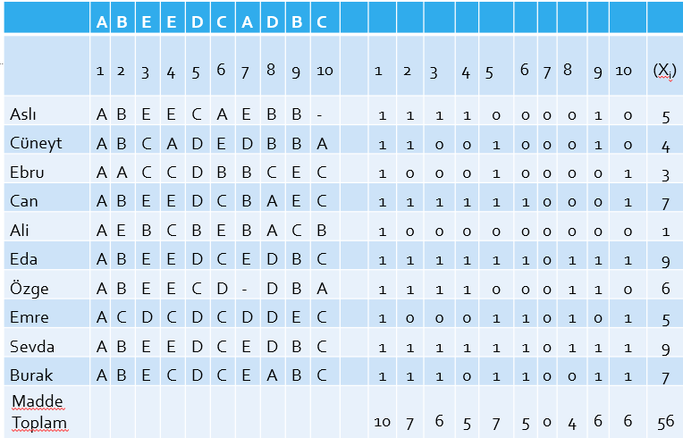

```{r, include=FALSE}
options(tinytex.verbose = TRUE)
```

```{r setup, include=FALSE}
knitr::opts_chunk$set(echo = FALSE)
library(tidyverse)
library(kableExtra)
library(knitr)
library(dplyr) 
library(tidyr)
library(kableExtra)
library(lattice)
library(ggplot2)
library(tibble)

```


# Test GeliştirmeAşamaları

-   **Amacın belirlenmesi**

-   **Kapsamın belirlenmesi**

-   **Maddelerin yazılması ve düzeltilmesi**

-   **Ön uygulama**

-   **Madde analizi ve madde seçimi**

-   **Son testin oluşturulması, uygulanması ve puanlanması**

---

## **Madde analizi ve madde seçimi**

- Ölçme araçlarının birimlerinden bahsederken soru ifadesi yerine madde ifadesi kullandığımızı hatırlatalım.

- Sınavlarda yer alan sorular her zaman puanlanmadığı için puanlanabilen soruları da içeren madde kavramı daha uygun bir ifadedir.

- Ölçme araçlarının güvenilir ve geçerli olmasının sağlanabilmesi için testin ön uygulama sonuçlarından yararlanılarak testteki her bir maddenin analizi yapılır ve maddenin istenilen özelliklere sahip olup olmadığı araştırılır.

- Yapılacak analizler: madde güçlüğü, madde ayırıcılığı, madde varyansı ve standart sapması, madde güvenirliğidir.

---
## Sınav İçin Hazırlanan Soruların Gözden Geçirilmesi

-   Soru İnceleme iki başlık altında yapılır. Bunlar:

    -   Deneme uygulamasının olmadığı durumlarda soru yazma ölçütlerine göre inceleme.

    -   Deneme Uygulaması yapıldığında, madde istatistiklerine göre inceleme.

---

## Soru İnceleme

**Deneme uygulamasının olmadığı durumlarda soru yazma ölçütlerine göre inceleme**

-   ÖSYM ve MEB tarafından yapılan birçok sınavın sınav yapmadan önce pilot grup üzerinde denenmesi olanağı bulunmamaktadır.

-   Bu nedenle seçme amaçlı yapılan sınavlarda soru yazma ölçütlerine göre ön inceleme yapılmalıdır.

---

## Soru İnceleme

Bu incelemede:

-   Sorunun hangi kazanımı yoklayacağına bakılır.

-   Sorunun düzeyi ile kazanım düzeyi karşılaştırılabilir.

-   Sorunun zorluk düzeyi ve Sorunun ayırıcılık düzeyi hakkında tahminde bulunulabilir.

-   Soruların tamamı için sınavın amacını ölçmede yeterliliği hakkında görüşler alınabilir.

-   Kapsam geçerliliğinin uygunluğu istenebilir.

---

## Soru İnceleme

Bu incelemede:

-   Sorular hangi madde türünde yazılmış ise o madde türüne özgü soru yazılma kurallarına uygunluğu açısından kontrol edilir.

    -   Yazılı Yoklama
    -   Kısa cevaplı
    -   Çoktan seçmeli
    -   Doğru-Yanlış
    -   Sözlü vs.

-   Her şeyden önce soruların sınavı alan tüm öğrenciler tarafından aynı şekilde algılanması gerekir.

-   Sınav kapsamındaki tüm konuları temsil edecek sorular bulunmalıdır.

---

## Soru İnceleme

-   Soru yazarının hazırlanacak alana ilişkin yeterlilikleri tam olmalıdır. Alana hakim olmalıdır.

-   Soru yazarının soru yazma konusunda deneyimlerinin fazla olması gerekir. Soru yazarının ölçme ve değerlendirme konusunda yeterlilikleri olması gerekir.

-   Belirtilen tüm ölçütler açısından yeterliliği bulunan kişilerin hazırladıkları sorularda bile düzeltilecek yönler bulunabilir.

---

## Soru İnceleme

-   Hiçbir zaman ideal bir soru yoktur, ideale yakın sorular vardır.

-   Yazılan sorular evimizdeki halılar gibidir ve her vurulduğunda tozu çıkar.

-   Bu nedenle her sorunun farklı gözle incelenmesinde fayda vardır.

---

## Soru İnceleme

**Deneme uygulaması yapıldığında soru inceleme:**

-   Seçme amaçlı yapılmayan, başarı belirleme sınavlarında ön uygulama yapılarak soruların hesaplanabilecek özelliklerine göre sorularda düzeltme çalışmaları yapılabilir.

Bu incelemede:

-   Soruların zorluk ya da kolaylık düzeylerine bakılır.

-   Testte yer alan soruların çok kolay veya çok zor olması istenilen bir durum değildir.

-   Çok kolay ya da çok zor sorular sınıftaki öğrencileri ayıt etmede yetersiz olabilirler.

---

## Soru İnceleme

**Deneme uygulaması yapıldığında soru inceleme:**

-   Bir sınavda çok zor ya da çok kolay sorular olabilir; ancak bunların oranı, sınavın amacına göre değişebilir.

    -   Seçme
    -   Sıralama
    -   Başarı belirleme
    -   İzleme
    -   Yarışma vs. sınavlarında bu zorluklar farklılık gösterebilir.

---

## Soru İnceleme

**Deneme uygulaması yapıldığında soru inceleme:**

-   Sorunun zorluk düzeyi, soruya doğru cevap verenlerin tüm öğrencilere oranı ile hesaplanabilir.

-   Zorluk düzeyi

$$
 p = \frac{maddeye dogru cevap verenler}{tum cevaplayıcılar}
$$

---

## Madde Güçlüğü

$$
p_{j}= \frac{n(D)}{N}
$$

$p_{j}$ : j. maddesinin güçlük indeksi

$n(D)$: Maddeye doğru cevap veren öğrenci sayısı

$N$: Maddeye cevap veren öğrenci sayısı

---

## Madde Güçlüğü

200 kişinin katıldığı bir sınavda yer alan 15. soruyu 200 kişi de doğru cevaplandırdığında sorunun güçlük düzeyi,

$$
p_{j}= \frac{n(D)}{N}
$$

$p_{15}=200/200=1,00$ olarak bulunur.

Sizce bu soru nasıldır?

---

## Madde Güçlüğü

Sınavdaki 20. soruyu 10 kişi doğru cevaplamış ise güçlük düzeyi,

$p_{20}=10/200=0,05$ olarak bulunur. olarak bulunur. Sizce bu soru nasıldır?

YA DA

## Madde Güçlüğü

Sınavdaki 25. soruyu 100 kişi doğru cevaplamış ise güçlük düzeyi,

$p_{25}=100/200=0,50$ olarak bulunur. olarak bulunur.

Sizce bu soru nasıldır?

Bu üç soru birbirleri ile karşılaştırıldığında nasıl bir yorum yaparsınız?

---

## Madde Guclugu

|                     |               |
|---------------------|---------------|
| Madde Güçlük Değeri | Yorumu        |
| 0,00 -- 0,20        | Çok Zor       |
| 0,20 -- 0,40        | Zor           |
| 0,40 -- 0,60        | Orta Güçlükte |
| 0,60 -- 0,80        | Kolay         |
| 0,80 -- 1,00        | Çok kolay     |

---

## Madde Güçlüğü

Çoktan seçmeli sorularda seçeneklerin dağılımına bakılır.Bir çoktan seçmeli soruda seçeneklerden doğru cevap dışındakilere verilen cevapların eşit olması gerekir.


| **Seçenekler**  | **Cevap sayıları** |
|---|---|
| A               | $n(A)$             |
| B               |  $n(B)$                 |
| C               | $n(C)$                 |
| D               | $n(D)$                 |
| E (Doğru cevap) | $n(E)$                |
| Toplam          | $N$               |

---

## **Soru İnceleme**

Seçeneklerin dağılımında tablodaki bir durum ile karşılaştığımızda bu soru için ne diyebiliriz?


| **Seçenekler**  | **Cevap sayıları** |
|---|---|
| A               | 5                  |
| B               | 45                 |
| C               | 15                 |
| D               | 35                 |
| E (Doğru cevap) | 100                |
| Toplam          | 200                |

-   Sorulara tüm kişilerin verdikleri cevaplara göre yaptığımız yorumları biraz daha ayrıntılı olarak incelersek,

-   Sınıftaki iyi (testten yüksek puan alan) ve iyi olmayan (testten düşük puan alan) öğrencilerin verdikleri cevapların seçeneklere dağılımına bakalım.

---

## **Soru İnceleme**

Üst ve Alt Grupların ilgili sorudaki cevaplarının incelenmesinde aşağıdaki gibi bir tablodan yararlanabilir.

|        | A          | B          | C          | D          | E          | Toplam   |
|---|---|---|---|---|---|---|
| Ust    | $n(A_{ü})$ | $n(B_{ü})$ | $n(C_{ü})$ | $n(D_{ü})$ | $n(E_{ü})$ | $n(üst)$ |
| Alt    | $n(A_{a})$ | $n(B_{a})$ | $n(C_{a})$ | $n(D_{a})$ | $n(E_{a})$ | $n(alt)$ |
| Toplam | $n(A)$     | $n(B)$     | $n(C)$     | $n(D)$     | $n(E)$     | $N$      |


---

## **Soru İnceleme**

Üst ve Alt Grupların ilgili sorudaki cevaplarının incelenmesinde aşağıdaki gibi bir tablodan yararlanabilir.

+-----------+--------+--------+---------+--------+-------+-----------+
|           | A      | B      | C       | D      | E\*   | Toplam    |
+===========+========+========+=========+========+=======+===========+
| Ust       | 1      | 5      | 5       | 20     | 80    | 111       |
+-----------+--------+--------+---------+--------+-------+-----------+
| Alt       | 4      | 40     | 10      | 15     | 20    | 89        |
+-----------+--------+--------+---------+--------+-------+-----------+
| Toplam    | 5      | 45     | 15      | 35     | 100   | 200       |
+-----------+--------+--------+---------+--------+-------+-----------+

Bu soru hakkındaki düşünceniz ne olur?

---

**Madde analizi ve madde seçimi**

-   Madde analiz teknikleri, test maddelerinin nasıl puanlandığına bağlı olarak değişim gösterir.

-   İki Kategorili Puanlama: Maddelerin doğru yanıtı için 1 puan, yanlış, boş bırakılan ve çoktan seçmeli testlerde birden çok seçeneğin seçilmesi durumu için 0 puan

-   İki kategorili puanlama çoktan seçmeli testlerde, doğru-yanlış testlerinde kullanılır. Kısa cevaplı testlerde de kullanılabilir.

-   İki kategorili puanlanan maddelerin analizi için kullanılan 2 yöntem bulunmaktadır:

    -   Henrysson Yöntem

    -   Basit Yöntem (Alt Grup -- Üst Grup Yöntemi)
---

# Madde Analizleri

-   Madde güçlüğü $p_{j}$

-   Madde ayırıcılığı $r_{jx}$

-   Madde varyansı $S_{x}^2$ ve Standart Sapması$S_{x}$

-   Madde güvenirliği $r_{x}$

---

## Madde Analizi

-   Madde güçlük indeksi, iki kategorili puanlanan (1 veya 0 olarak puanlanan) bir madde için madde puanlarının ortalamasıdır.

-   Bir maddeyi doğru cevaplayan birey sayısının gruptaki tüm birey sayısına oranı olarak tanımlanır.

-   Diğer bir ifadeyle madde güçlük indeksi, bir maddenin doğru cevaplanma yüzdesidir.

---

## Madde Analizi


```{r echo=FALSE, fig.align='center'}

```

---

## Madde güçlüğü $p_{j}$

$p_{j} =\frac{dogru\quad cevaplayan \quad ogrenci\quad sayisi}{toplam \quad ogrenci \quad sayisi}$

$p_{j} =\frac{ust \quad grupta \quad + \quad alt\quad grupta \quad dogru\quad cevaplayan \quad ogrenci \quad sayisi}{toplam \quad ogrenci \quad sayisi}$

| Madde_1  | A   | B   | C   | D\*    | E   | TOPLAM |
|----------|-----|-----|-----|--------|-----|--------|
| Ust Grup | 10  | 13  | 10  | **15** | 2   | 50     |
| Alt Grup | 22  | 10  | 10  | **5**  | 3   | 50     |
| TOPLAM   | 32  | 23  | 20  | **20** | 5   | 100    |

: Madde Analiz Tablosu

---
## Madde güçlüğü $p_{j}$

-   Testi alan tüm öğrenciler bu maddeyi bilseydi, bu durumda madde güçlüğü:

    -   100/100=1 (madde güçlüğünün alabileceği maksimum değer)

-   Bu madde hiçbir öğrenci tarafından doğru cevaplanamasaydı, bu durumda madde güçlüğü:

    -   0/100=0 (madde güçlüğünün alabileceği minimum değer)

Madde güçlüğünün orta değeri 0.50'dir. Bu değer maddenin orta güçlükte (zorlukta) olduğunun göstergesidir. Madde güçlüğü azaldıkça yani 0'a yaklaştıkça (bilemeyen sayısı arttıkça) madde zorlaşır, madde güçlüğü arttıkça yani 1'e yaklaştıkça (bilen sayısı arttıkça) madde kolaylaşır**.**

---

## Madde güçlüğü $p_{j}$

-   Bir testi oluşturan maddelerin güçlük indeksleri, testin güçlüğünü doğrudan etkiler.

    -   Eğer testi oluşturan maddeler zorolursa, test zor bir test olacaktır.

    -   Eğer testi oluşturan maddeler kolay olursa da test kolay bir test olacaktır.

Bir testin geniş ranjda bir puan dağılımına (tercihen normal dağılım) sahip olması için testin bütün güçlükteki soruları içermesi istenilen bir durumdur. Eğer test geniş ranjda bir puan dağılımına sahip olmazsa, ölçülen özellik bakımından bireyler arası farklılıklara ilişkin bilgi sağlanamayacaktır.

---

## Madde güçlüğü $p_{j}$

-   Ölçülen özellik açısından bireyler arası farklılıkları ortaya çıkarmak başarı testleri için oldukça önemli bir konudur.
-   Başarı testini oluşturan maddelerin güçlük indekslerinin ortalamasının 0.50 olmasına ve bütün yetenek düzeylerine hitap edecek biçimde geniş bir ranjda değişim göstermesine dikkat edilmelidir.
-   Bir kritere göre bir test oluşturan maddelerin güçlük indeksleri 0.10 ile 0.90, başka bir kritere göre ise 0.20 ile 0.80 arasında dağılım göstermeli, bu dağılım mümkün olduğunca normal olmalıdır; maddelerin çoğu orta güçlükte olmalı, güçlük düzeyi azaldıkça veya çoğaldıkça soru sayısı azalmalıdır.

---

## Madde ayırıcılığı $r_{jx}$

-   Testle ölçülmek istenen özelliğe sahip olanla sahip olmayanı ayırmak için kullanılan bir indekstir.
-   Ölçülmek istenen özelliğe sahip olan bireylerin, testte yer alan maddelere doğru yanıt vermesi, sahip olmayan bireylerin ise yanlış yanıt vermesi beklenir.
-   Madde puanları ile test puanları arasında hesaplanan korelasyon katsayısı madde ayırıcılık indeksini verir.
-   Madde puanları süreksiz değişken, test puanları ise sürekli değişken olduğundan madde-test korelasyonunun hesaplanması için "Nokta-Çift Serili Korelasyon Katsayısı" kullanılır.

---

## Madde ayırıcılığı $r_{jx}$

-   Korelasyon hesabına dayalı bir indeks olduğu için +1.00 ile -1.00 arasında bir değer alır.
-   Bu indeksin değerinin artı olması, testteki belli bir maddeyi toplam puanı yüksek olanların toplam puanı düşük olanlardan daha fazla doğru cevapladığı anlamına gelir.
-   Bu indeksin değerinin eksi olması, testteki belli bir maddeyi toplam puanı düşük olanların toplam puanı yüksek olanlardan daha fazla doğru cevapladığı anlamına gelir.
-   Bu indeksin değerinin sıfır olması ise toplam puanı düşük olanlarla toplam puanı yüksek olanlar, testteki belli bir maddeyi eşit sıklıkta doğru cevaplamışlardır.

---

## Madde ayırıcılığı $r_{jx}$

-   Bir maddenin bilenleri bilmeyenlerden ayırabilmesinin derecesini verir.

-   Madde ayırıcılığı, bir maddenin en önemli istatistiğidir. Maddenin güvenirliğinin bir ölçüsünü verir. Bu sebeple, bir maddenin teste alınıp alınmamasına karar verirken öncelikle madde ayırıcılığının yüksek olup olmamasına bakılır.

$p_{j} =\frac{ust \quad grupta \quad - \quad alt\quad grupta \quad dogru\quad cevaplayan \quad ogrenci \quad sayisi}{(toplam \quad ogrenci \quad sayisi)/2}$

$p_{j} =\frac{ust \quad grupta \quad - \quad alt\quad grupta \quad dogru\quad cevaplayan \quad ogrenci \quad sayisi}{ust\quad gruptaki \quad ogrenci\quad sayisi}$

---

## Madde ayırıcılığı $r_{jx}$

-   üst ve alt gruptaki tüm öğrenciler bu maddeyi doğru bilseydi, bu durumda madde ayırıcılığı: 50-50/50=0

-   üst ve alt gruptaki hiçbir öğrenci bu maddeyi doğru cevaplayamasaydı, bu durumda da madde ayırıcılığı: 0-0/50=0

    -   Tüm öğrencilerin bildiği ya da hiç bir öğrenci tarafından bilinmeyen bir madde, bileni bilmeyenden ayıramamaktadır. Bu tür bir madde hiçbir şekilde teste alınmak istenmez.

-   üst gruptaki tüm öğrenciler maddeyi doğru cevaplarken, alt gruptaki hiçbir öğrenci doğru cevap verememiş olsaydı , bu durumda madde ayırıcılığı: 50-0/50=1 (madde ayırıcılığının alabileceği maksimum değer).

-   üst gruptaki öğrencilerin hiç biri maddeyi doğru cevaplayamazken, alt gruptaki tüm öğrenciler maddeye doğru cevap vermiş olsaydı , bu durumda madde ayırıcılığı: 0-50/50=-1 (madde ayırıcılığının alabileceği minimum değer)

---

## Madde ayırıcılığı $r_{jx}$

-   $$-1\le r_{jx} < 0$$

-   $$0 \le r_{jx} \le 0.19$$

-   $$0.20 \le r_{jx} \le 0.29$$

-   $$ r_{jx} \ge 0.30$$

---

## Madde ayırıcılığı $r_{jx}$

-   Düşük düzeyde ayırıcılık gücüne sahip maddelerin mutlaka incelenmesi gerekir.

-   Bu maddelerin ayırıcı olmamasının sebepleri aşağıdaki şekilde sıralanabilir:

    -   Sorunun iyi ifade edilememesi

    -   Farklı yorumlara açık olması

    -   Maddenin ölçülen özellik dışında başka bir özelliği ölçmesi

---

## Madde ayırıcılığı $r_{jx}$

-   Madde ayırıcılık indeksi aynı zamanda bireylerin belli bir özelliği ölçmek için yazılmış maddelere verdikleri tepkilerin (cevapların) bu özelliği temsil eden testin tümünden elde edilen puanlarla ne derece ilişkili olduğunu ifade eden önemli bir indekstir.

-   Eğer maddeye verilen tepkilerle (madde puanları) testin tamamından elde edilen puanlar arasında ilişki yoksa ve ya çok zayıfsa maddenin testle ölçmek istenen özelliği ölçtüğü şüphelidir.

---

## Madde ayırıcılığı $r_{jx}$

-   Bu indeksin değerinin artı olması, maddenin testle ölçülmek istenen özelliği ölçtüğü anlamına gelir.

-   Bu indeksin değerinin sıfır olması, maddenin testle ölçülmek istenen özelliği ölçmediği anlamına gelir.

-   Bu indeksin değerinin eksi olması, ise maddenin testle ölçülen özellikten başka bir özelliği ölçtüğü şeklinde yorumlanır.

---

## Bir maddenin teste alınması için

-   Madde ayırıcılığının olabildiğince yüksek (1'e yakın) olması,

-   Madde güçlüğünün orta düzeyde (0.50 ve civarı) olması,

-   Çeldiricileri işaretleyen üst gruptaki öğrenci sayısının alt gruptaki öğrenci sayısından az olması,

-   Çeldiricileri işaretleyen öğrenci sayısının olabildiğince dengeli bir dağılım göstermiş olması istenir.

---

## Madde Analizi

| Madde_1  | A   | B   | C   | D\*    | E   | TOPLAM |
|----------|-----|-----|-----|--------|-----|--------|
| Ust Grup | 10  | 13  | 10  | **15** | 2   | 50     |
| Alt Grup | 22  | 10  | 10  | **5**  | 3   | 50     |
| TOPLAM   | 32  | 23  | 20  | **20** | 5   | 100    |

: Madde Analiz Tablosu

---

# Çeldirici Analizi

| Madde_2  | A   | B   | C\* | D      | E   | TOPLAM |
|----------|-----|-----|-----|--------|-----|--------|
| Ust Grup | 0   | 0   | 100 | **0**  | 0   | 100    |
| Alt Grup | 25  | 25  | 0   | **25** | 25  | 100    |
| TOPLAM   | 25  | 25  | 100 | **25** | 25  | 200    |

: Madde Analiz Tablosu

---

## Çeldirici Analizi

| Madde_3  | A   | B   | C\* | D   | E   | TOPLAM |
|----------|-----|-----|-----|-----|-----|--------|
| Ust Grup | 4   | 6   | 80  | 6   | 4   | 100    |
| Alt Grup | 20  | 22  | 18  | 19  | 21  | 100    |
| TOPLAM   | 24  | 28  | 98  | 25  | 25  | 200    |

: Madde Analiz Tablosu

---

## Çeldirici Analizi

| Madde_4  | A   | B   | C\* | D   | E   | TOPLAM |
|----------|-----|-----|-----|-----|-----|--------|
| Ust Grup | 18  | 19  | 20  | 26  | 17  | 100    |
| Alt Grup | 8   | 9   | 10  | 60  | 13  | 100    |
| TOPLAM   | 26  | 28  | 30  | 86  | 30  | 200    |

: Madde Analiz Tablosu

---

## Çeldirici Analizi

| Madde_5  | A   | B   | C\* | D   | E   | TOPLAM |
|----------|-----|-----|-----|-----|-----|--------|
| Ust Grup | 21  | 18  | 22  | 19  | 20  | 100    |
| Alt Grup | 19  | 23  | 20  | 17  | 21  | 100    |
| TOPLAM   | 40  | 41  | 42  | 36  | 41  | 200    |

: Madde Analiz Tablosu

---

## Çeldirici Analizi

| Madde_6  | A   | B   | C   | D   | E   | TOPLAM |
|----------|-----|-----|-----|-----|-----|--------|
| Ust Grup | 10  | 50  | 18  | 10  | 12  | 100    |
| Alt Grup | 35  | 15  | 25  | 15  | 10  | 100    |
| TOPLAM   | 45  | 65  | 43  | 25  | 22  | 200    |

: Madde Analiz Tablosu

---

## Çeldirici Analizi

| Madde_7  | A   | B   | C   | D   | E   | TOPLAM |
|----------|-----|-----|-----|-----|-----|--------|
| Ust Grup | 35  | 15  | 30  | 10  | 10  | 100    |
| Alt Grup | 10  | 50  | 18  | 10  | 12  | 100    |
| TOPLAM   | 45  | 65  | 48  | 20  | 22  | 200    |

: Madde Analiz Tablosu

---

## Çeldirici Analizi

| Madde_8  | A   | B   | C   | D   | E   | TOPLAM |
|----------|-----|-----|-----|-----|-----|--------|
| Ust Grup | 15  | 50  | 18  | 16  | 1   | 100    |
| Alt Grup | 35  | 15  | 25  | 21  | 4   | 100    |
| TOPLAM   | 50  | 65  | 43  | 37  | 5   | 200    |

: Madde Analiz Tablosu

---

## Çeldirici Analizi

+----------+---------+---------+---------+---------+---------+---------+
| Madde_9  | A       | B       | C       | D       | E       | TOPLAM  |
+==========+=========+=========+=========+=========+=========+=========+
| Ust Grup | 28      | 22      | 20      | 18      | 12      | 100     |
+----------+---------+---------+---------+---------+---------+---------+
| Alt Grup | 10      | 50      | 18      | 10      | 12      | 100     |
+----------+---------+---------+---------+---------+---------+---------+
| TOPLAM   | 38      | 72      | 38      | 28      | 24      | 200     |
+----------+---------+---------+---------+---------+---------+---------+

: Madde Analiz Tablosu


---

# Madde Değişkenliği

Madde varyansı ve standart sapması, bir maddeye verilen cevapların (0-1 puanlarının) değişiminin derecesini gösteren değerlerdir.

$$
S_{x}^2 = p_{j}(1- p_{j})
$$

$$
S_{x} = \sqrt
{p_{j}(1- p_{j})}
$$
---

## Madde Değişkenliği


```{r echo=FALSE, fig.align='center'}

```


madde 1, madde 6, madde 7

---

## Madde Değişkenliği

Madde varyansının minumum değeri 0, maksimum değeri ise 0.25

$$
0 \le S_{x}^2 \le 0.25
$$

Madde stndart sapmasının minumum değeri 0, maksimum değeri ise 0.5

$$
0 \le S_{x} \le 0.5
$$
---
## Madde Güvenirliği

-   Her bir maddenin güvenirliği, maddenin ayırıcılığı ve standart
    sapmasıyla doğru orantılı olarak artar.

-   $$
    r_{x} =  r_{jx} *S_{x}
    $$

-   Maddenin ayırıcılığı doğrudan güvenirliğini arttıran bir özelliktir.

-   Bu sebepledir ki madde ayırıcılığının olabildiğince yüksek olması
    istenilen bir özelliktir.

---
## Madde Güvenirliği

-   Madde standart sapması en yüksek değerine madde güçlüğü 0.50
    olduğunda ulaşmaktadır.

    -   Bu sebepledir ki madde güçlüğünün 0.50 veya civarında olması
        maddenin güvenirliğini dolaylı olarak arttıran bir diğer
        faktördür.

---
## Testin Ortalama Güçlüğü

-   Bir testin ortalama güçlüğü o testin maddelerine ait güçlük indeksi
    değerlerinin toplamının madde sayısına bölünmesiyle elde edilir.

-   Örnek olarak verilen testin ortalama güçlüğünü bulunuz?

---
## Madde Seçimi

Test geliştirmede madde analizi yapıldıktan sonra sıra maddelerin
seçilmesine gelir. Madde seçmede bazı noktalara dikkat etmek gerekir.

1.  Madde seçiminde ilk amaç testin güvenirliğini yükseltmek yani
    puanların genişçe dağılmasını sağlamak ise ayırt etme indeksi en
    büyük olan maddeler seçilmelidir.

2.  Ayırt etme indeksi 0,30 ve daha büyük olan yeterince madde varsa,
    bunlar arasından istenilen güçlükte olanlar seçilir.

3.  Seçilecek maddelerin güçlük dereceleri maddelerin oluşturacağı
    testin kullanılış maksadına göre belirlenmelidir.

4.  Ayırt etme indeksi yüksek maddelerin seçilmesi testin güvenirliğini
    artırabilir. Ne var ki, bir test geliştirici bazen güvenirliğini
    artırmaya çalıştığı bir testin kapsam geçerliliğini düşürebilir. Bu
    yüzden yeni bir test oluştururken belirtke tablosuna bağlı kalmak
    gerekir.

---
## Teşekkürler
